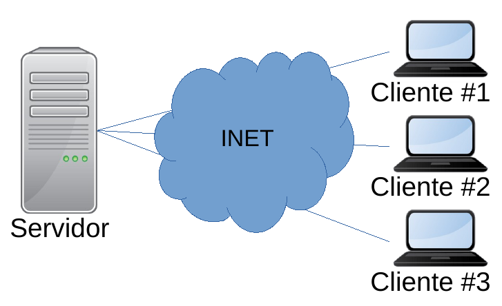
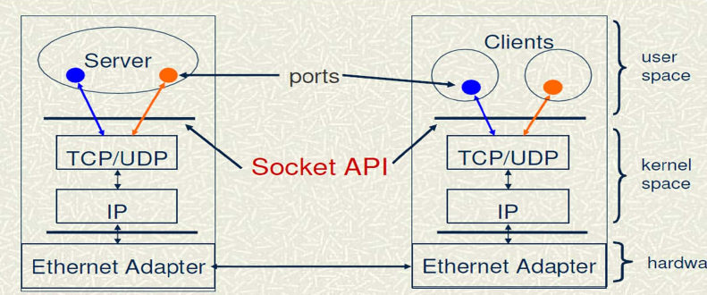
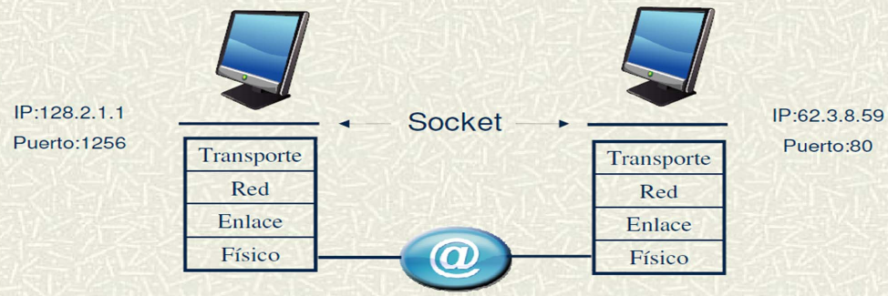
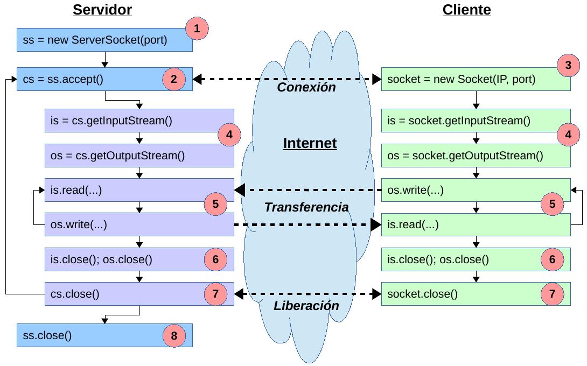

---

marp: true
size: 16:9
paginate: true
footer: '(c) 2022 Gorka Prieto'
header: 'Tema 10: Sockets TCP/IP'
style: |
    section {font-size: 18pt}

---

Programación en Entornos Distribuidos{.h1}

Tema 10: Sockets TCP/IP{.h2}

<br/>

{.line}

<br/>

2º Ingeniería en Tecnología de Telecomunicación (UPV/EHU){.s3}

Curso 2021/2022{.s3}

---

Licencia de uso{.h1}

©2019-2022, Gorka Prieto Agujeta <<gorka.prieto@ehu.eus>>

Se otorga permiso para copiar, distribuir y/o modificar este documento bajo los términos de la Licencia de Documentación Libre de GNU en su versión 1.2 o cualquier otra versión posterior publicada por la Free Software Foundation, siendo todo él invariante. Una copia de la licencia está disponible en la web de la Free Software Foundation, dentro de la sección titulada GNU Free Documentation License.

[yes]: figs/yes.png
[no]: figs/no.png

---

Índice{.h1}

:::autocols
@[toc]
:::

---

# Introducción

## Entornos distribuidos

### Sistemas distribuidos


- Componentes ubicados en distintos equipos conectados por red
- Se envían mensajes empleando protocolos de comunicaciones
- Capas (_layers_):
    - Capa de red: IP
    - Capa de transporte: TCP, UDP
    - Capa de aplicación: HTTP, SOAP, RMI, etc.

### Programación distribuida

- Creación de programas que corren en sistemas distribuidos
- Aplicaciones multinivel. Caso más sencillo: 2 niveles (_tiers_):
    - **Servidor**: en <u>espera</u> de recibir petición, realiza procesamiento y devuelve resultado
    - **Cliente**: <u>inicia</u> interacción, envía petición

---

<style scoped>
    section {
        display: block;
    }
    table {
        width: max-content;
        float: right;
        font-size: 14pt;
        margin-right: 200px;
    }
    footer {
        display: none;
    }
</style>

## TCP/IP

- Comunicación TCP/IP:
    - **Cuarteto**: IP origen, IP destino, puerto origen, puerto destino

|Número|Servicio
|------|--------
|20,21 | FTP (transferencia ficheros)
|22    | SSH (shell remota)
|25    | SMTP (envío de e-mail)
|53    | DNS (nombres de dominio)
|80    | HTTP (web)
|443   | HTTPS (web segura)

- Concepto de **puerto**:    
    - Número de 16 bits
    - Identifica un proceso o un servicio específico en la máquina (misma IP)
    - Valores:
        - Reservados (root): 0 – 1023
        - Usuario: >= 1024
        - Well-known ==>

:::autocols
- **TCP** (modo **conectado**):
    - Retransmisión en caso de error
    - Mecanismos de control de flujo
    - {.break}
- UDP (modo no conectado):
    - Menos sobrecarga → mayor velocidad
    - Pérdida paquetes, duplicados, etc.
:::

---

## Estrategias de servicio

- Llamadas **bloqueantes**:
    - Recepción: el proceso se queda bloqueado hasta recibir un dato
    - Envío: se desbloquea al copiar el dato en el buffer de salida
- Estrategias de servicio:
    - Cliente único:
        - El servidor acaba tras terminar la comunicación con el cliente
    - **Iterativo**: 
        - Cuando acaba la comunicación con un cliente espera una nueva comunicación con otro nuevo cliente
    - Concurrente:
        - Capaz de atender varias comunicaciones con distintos clientes simultáneamente
        - Programación multihilo o uso de llamadas no bloqueantes

---

# Sockets

## Introducción

- ¿Qué es un socket?: 
    - Mecanismo de bajo nivel para comunicación por red
    - API del sistema operativo (kernel) a las aplicaciones de usuario
- Representa un punto final (**endpoint**) de una comunicación <u>bidireccional</u> entre dos programas a través de una red: 
    - Cada extremo es un endpoint
    - Ligados a una <u>dirección IP y número de puerto</u>
    - La comunicación queda identificada por sus dos endpoints
- La aplicación los crea, trabaja con ellos y los cierra

---

## Clases

- Paquete `java.net`
- [Socket](https://docs.oracle.com/javase/8/docs/api/java/net/Socket.html):
    - Socket TCP activo
    - Usado endpoint de la comm tanto en cliente como en el servidor
- [ServerSocket](https://docs.oracle.com/javase/8/docs/api/java/net/ServerSocket.html):
    - Socket TCP pasivo
    - Usado en el servidor para esperar conexiones de clientes
- [InetAddress](https://docs.oracle.com/javase/8/docs/api/java/net/InetAddress.html):
    - Dirección IP
    - Permite resolución de nombres DNS (directa e inversa)
    - Subclases: `Inet4Address`, `Inet6Address`
- Otras clases (no las vemos):
    - Sockets UDP, URLs, HTTP, etc.

---

## Pasos

1. El servidor crea un **ServerSocket** escuchando en una IP y <u>puerto</u>
2. El cliente crea un **Socket** para solicitar una conexión a la <u>IP y puerto del servidor</u>:     
    - El cliente también necesitará su propio puerto.
    - El sistema le asignará un puerto automáticamente si no lo indica él manualmente.
    - El cliente puede ayudarse de `InetAddress` para obtener la IP a partir del nombre del servidor.
3. El servidor **acepta** la conexión mediante `ServerSocket`: 
    1. El servidor obtiene un <u>nuevo</u> **Socket**:
        - Asignado a la misma IP y puerto del servidor 
        - Endpoint remoto asignado a la IP y puerto del cliente
        - Le permite seguir usando el ServerSocket para atender nuevas peticiones
    2. En el cliente se termina de crear el socket para poder utilizarlo

:::note
https://docs.oracle.com/javase/tutorial/networking/sockets/index.html
:::

---

4. Cliente y servidor **obtienen sus flujos** de E/S al socket:
    - <u>Mapeándolos</u> al tipo de flujo que más les interese: binarios, texto
5. Cliente y servidor **operan** con estos flujos. Típicamente:
    1. <u>Cliente escribe</u> petición en su `OutputStream`
    2. <u>Servidor lee</u> petición desde su `InputStream`
    3. <u>Servidor procesa</u> la petición y obtiene resultado
    4. <u>Servidor escribe</u> el resultado en su `OutputStream`
    5. <u>Cliente lee</u> resultado desde su `InputStream`
6. Cliente y servidor **cierran sus flujos**
7. Cliente y servidor **cierran sus sockets**
8. Servidor mantiene `ServerSocket` abierto si va a atender a más clientes, y si no lo cierra

---



---

<style scoped>
    table {
        font-size: 14pt;
    }
    table p {
        margin: 0px;
    }
</style>

# API

## InetAddress

| Modifier and Type| Method and Description|
|---|---|
| static [InetAddress](https://docs.oracle.com/javase/8/docs/api/java/net/InetAddress.html "class in java.net") | [getByName](https://docs.oracle.com/javase/8/docs/api/java/net/InetAddress.html#getByName-java.lang.String-)([String](https://docs.oracle.com/javase/8/docs/api/java/lang/String.html "class in java.lang") host) | \
| | Determines the IP address of a host, given the host's name. |
| [String](https://docs.oracle.com/javase/8/docs/api/java/lang/String.html "class in java.lang") | [getCanonicalHostName](https://docs.oracle.com/javase/8/docs/api/java/net/InetAddress.html#getCanonicalHostName--)() | \
| | Gets the fully qualified domain name for this IP address. |
| [String](https://docs.oracle.com/javase/8/docs/api/java/lang/String.html "class in java.lang") | [getHostAddress](https://docs.oracle.com/javase/8/docs/api/java/net/InetAddress.html#getHostAddress--)() | \
| | Returns the IP address string in textual presentation. |
| [String](https://docs.oracle.com/javase/8/docs/api/java/lang/String.html "class in java.lang") | [getHostName](https://docs.oracle.com/javase/8/docs/api/java/net/InetAddress.html#getHostName--)() | \
| | Gets the host name for this IP address. |
| static [InetAddress](https://docs.oracle.com/javase/8/docs/api/java/net/InetAddress.html "class in java.net") | [getLocalHost](https://docs.oracle.com/javase/8/docs/api/java/net/InetAddress.html#getLocalHost--)() | \
| | Returns the address of the local host. |

:::note
https://docs.oracle.com/javase/8/docs/api/java/net/InetAddress.html
:::

---

## Socket

|Constructor and Description|
|---|
|[Socket](https://docs.oracle.com/javase/8/docs/api/java/net/Socket.html#Socket-java.net.InetAddress-int-)([InetAddress](https://docs.oracle.com/javase/8/docs/api/java/net/InetAddress.html "class in java.net") address, int port)| \
Creates a stream socket and connects it to the specified port number at the specified IP address. |
|[Socket](https://docs.oracle.com/javase/8/docs/api/java/net/Socket.html#Socket-java.lang.String-int-)([String](https://docs.oracle.com/javase/8/docs/api/java/lang/String.html "class in java.lang") host, int port)| \
Creates a stream socket and connects it to the specified port number on the named host. |

:::note
https://docs.oracle.com/javase/8/docs/api/java/net/Socket.html
:::

---

<style scoped>
    table {
        font-size: 14pt;
    }
    td {
        padding: 0px 10px;
    }
    table p {
        margin: 0px;
    }
</style>

|Modifier and Type|Method and Description|
|---|---|
|`void`|[bind](https://docs.oracle.com/javase/8/docs/api/java/net/Socket.html#bind-java.net.SocketAddress-)([SocketAddress](https://docs.oracle.com/javase/8/docs/api/java/net/SocketAddress.html "class in java.net") bindpoint)| \
| | Binds the socket to a local address.|
|`void`|[close](https://docs.oracle.com/javase/8/docs/api/java/net/Socket.html#close--)() | \
| | Closes this socket.|
|`void`|[connect](https://docs.oracle.com/javase/8/docs/api/java/net/Socket.html#connect-java.net.SocketAddress-)([SocketAddress](https://docs.oracle.com/javase/8/docs/api/java/net/SocketAddress.html "class in java.net") endpoint)| \
| | Connects this socket to the server.|
|`void`|[connect](https://docs.oracle.com/javase/8/docs/api/java/net/Socket.html#connect-java.net.SocketAddress-int-)([SocketAddress](https://docs.oracle.com/javase/8/docs/api/java/net/SocketAddress.html "class in java.net") endpoint, int timeout)| \
| | Connects this socket to the server with a specified timeout value.|
|[InetAddress](https://docs.oracle.com/javase/8/docs/api/java/net/InetAddress.html "class in java.net")|[getInetAddress](https://docs.oracle.com/javase/8/docs/api/java/net/Socket.html#getInetAddress--)()| \
| | Returns the address to which the socket is connected.|
|[InputStream](https://docs.oracle.com/javase/8/docs/api/java/io/InputStream.html "class in java.io")|[getInputStream](https://docs.oracle.com/javase/8/docs/api/java/net/Socket.html#getInputStream--)()| \
| | Returns an input stream for this socket.|
|[InetAddress](https://docs.oracle.com/javase/8/docs/api/java/net/InetAddress.html "class in java.net")|[getLocalAddress](https://docs.oracle.com/javase/8/docs/api/java/net/Socket.html#getLocalAddress--)()| \
| | Gets the local address to which the socket is bound.|
|`int`|[getLocalPort](https://docs.oracle.com/javase/8/docs/api/java/net/Socket.html#getLocalPort--)()| \
| | Returns the local port number to which this socket is bound.|

:::note
https://docs.oracle.com/javase/8/docs/api/java/net/Socket.html
:::

---

<style scoped>
    table {
        font-size: 14pt;
    }
    td {
        padding: 0px 10px;
    }
    table p {
        margin: 0px;
    }
</style>

|Modifier and Type|Method and Description|
|---|---|
|[OutputStream](https://docs.oracle.com/javase/8/docs/api/java/io/OutputStream.html "class in java.io")|[getOutputStream](https://docs.oracle.com/javase/8/docs/api/java/net/Socket.html#getOutputStream--)()| \
| | Returns an output stream for this socket.|
|`int`|[getPort](https://docs.oracle.com/javase/8/docs/api/java/net/Socket.html#getPort--)()| \
| | Returns the remote port number to which this socket is connected.|
|`int`|[getReceiveBufferSize](https://docs.oracle.com/javase/8/docs/api/java/net/Socket.html#getReceiveBufferSize--)()| \
| | Gets the value of the [`SO_RCVBUF`](https://docs.oracle.com/javase/8/docs/api/java/net/SocketOptions.html#SO_RCVBUF) option for this `Socket`, that is the buffer size used by the platform for input on this `Socket`.|
|`int`|[getSendBufferSize](https://docs.oracle.com/javase/8/docs/api/java/net/Socket.html#getSendBufferSize--)()| \
| | Get value of the [`SO_SNDBUF`](https://docs.oracle.com/javase/8/docs/api/java/net/SocketOptions.html#SO_SNDBUF) option for this `Socket`, that is the buffer size used by the platform for output on this `Socket`.|
|`boolean`|[isBound](https://docs.oracle.com/javase/8/docs/api/java/net/Socket.html#isBound--)()| \
| | Returns the binding state of the socket.|
|`boolean`|[isClosed](https://docs.oracle.com/javase/8/docs/api/java/net/Socket.html#isClosed--)()| \
| | Returns the closed state of the socket.|
|`boolean`|[isConnected](https://docs.oracle.com/javase/8/docs/api/java/net/Socket.html#isConnected--)()| \
| | Returns the connection state of the socket.|

:::note
https://docs.oracle.com/javase/8/docs/api/java/net/Socket.html
:::

---

## ServerSocket

|Constructor and Description|
|---|
|[ServerSocket](https://docs.oracle.com/javase/8/docs/api/java/net/ServerSocket.html#ServerSocket--)()| \
|Creates an unbound server socket.|
|[ServerSocket](https://docs.oracle.com/javase/8/docs/api/java/net/ServerSocket.html#ServerSocket-int-)(int port)| \
|Creates a server socket, bound to the specified port.|
|[ServerSocket](https://docs.oracle.com/javase/8/docs/api/java/net/ServerSocket.html#ServerSocket-int-int-)(int port, int backlog)| \
|Creates a server socket and binds it to the specified local port number, with the specified backlog.|
|[ServerSocket](https://docs.oracle.com/javase/8/docs/api/java/net/ServerSocket.html#ServerSocket-int-int-java.net.InetAddress-)(int port, int backlog, [InetAddress](https://docs.oracle.com/javase/8/docs/api/java/net/InetAddress.html "class in java.net") bindAddr)| \
|Create a server with the specified port, listen backlog, and local IP address to bind to.|

:::note
https://docs.oracle.com/javase/8/docs/api/java/net/ServerSocket.html
:::

---

<style scoped>
    table {
        font-size: 14pt;
    }
    td {
        padding: 0px 5px;
    }
    table p {
        margin: 0px;
    }
</style>

|Modifier and Type|Method and Description|
|---|---|
|[Socket](https://docs.oracle.com/javase/8/docs/api/java/net/Socket.html "class in java.net")|[accept](https://docs.oracle.com/javase/8/docs/api/java/net/ServerSocket.html#accept--)()|\
| | Listens for a connection to be made to this socket and accepts it.|
|`void`|[bind](https://docs.oracle.com/javase/8/docs/api/java/net/ServerSocket.html#bind-java.net.SocketAddress-)([SocketAddress](https://docs.oracle.com/javase/8/docs/api/java/net/SocketAddress.html "class in java.net") endpoint)| \
| | Binds the `ServerSocket` to a specific address (IP address and port number).|
|`void`|[bind](https://docs.oracle.com/javase/8/docs/api/java/net/ServerSocket.html#bind-java.net.SocketAddress-int-)([SocketAddress](https://docs.oracle.com/javase/8/docs/api/java/net/SocketAddress.html "class in java.net") endpoint, int backlog)| \
| | Binds the `ServerSocket` to a specific address (IP address and port number).|
|`void`|[close](https://docs.oracle.com/javase/8/docs/api/java/net/ServerSocket.html#close--)()| \
| | Closes this socket.|
|[InetAddress](https://docs.oracle.com/javase/8/docs/api/java/net/InetAddress.html "class in java.net")|[getInetAddress](https://docs.oracle.com/javase/8/docs/api/java/net/ServerSocket.html#getInetAddress--)()| \
Returns the local address of this server socket.|
|`int`|[getLocalPort](https://docs.oracle.com/javase/8/docs/api/java/net/ServerSocket.html#getLocalPort--)()| \
| | Returns the port number on which this socket is listening.|
|`boolean`|[isBound](https://docs.oracle.com/javase/8/docs/api/java/net/ServerSocket.html#isBound--)()| \
| | Returns the binding state of the ServerSocket.|
|`boolean`|[isClosed](https://docs.oracle.com/javase/8/docs/api/java/net/ServerSocket.html#isClosed--)()| \
| | Returns the closed state of the ServerSocket.|

:::note
https://docs.oracle.com/javase/8/docs/api/java/net/ServerSocket.html
:::

---

# Ejemplos

## Introducción

- Por cada ejemplo tenemos **tres proyectos**:
    - Servidor (tipo aplicación)
    - Cliente (tipo aplicación)
    - Código común (tipo librería):
        - Referenciado desde los dos proyectos: cliente y servidor
- Ejecución:
    - 1º servidor
    - 2º cliente
    - Cuidado en sucesivas ejecuciones:
        - Puerto ya en uso
        - Necesario detener ejecución previa

---

## Transferencia de fichero

### Cliente

```java
public class BinClient {

    public static void main(String[] args) {
        File file = new File("/home/gorka/prueba.txt");
        try(
            InputStream is = new FileInputStream(file);
            Socket socket = new Socket(Service.SERVER, Service.PORT);
            DataOutputStream dos = new DataOutputStream(socket.getOutputStream());                
        ) {            
            dos.writeUTF(file.getName());
            dos.writeLong(file.length());
            IOUtils.copy(is, dos, Service.BUFFER_SIZE, file.length());
            System.out.println("Enviado fichero: " + IOUtils.info(file));
        } catch( Exception e ) {
            System.err.printf("Error al enviar fichero: %s\n", e.getMessage());
        }
    }    
}
```

---

### Servidor (iterativo)

```java
public class BinServer {

    public static void main(String[] args) {
        try(ServerSocket ss = new ServerSocket(Service.PORT)) {
            do {
                System.out.println("Esperando cliente ...");
                try(Socket cs = ss.accept()) {
                    System.out.println("Nuevo cliente: " + cs.getInetAddress().getHostAddress());
                    File file = serve(cs);
                    System.out.println("Recibido fichero: " + IOUtils.info(file));
                    System.out.println();
                } catch( Exception e ) {
                    System.err.printf("Error al atender al cliente: %s\n", e.getMessage());
                }             
            } while(true);
        } catch( Exception e ) {
            System.err.printf("Error al esperar clientes: %s\n", e.getMessage());
        }
    }

    private static File serve(Socket cs) throws IOException {
        try(DataInputStream dis = new DataInputStream(cs.getInputStream())) {
            String fileName = dis.readUTF();
            long size = dis.readLong();
            File file = new File("/tmp", fileName);
            try(OutputStream os = new FileOutputStream(file)) {            
                IOUtils.copy(dis, os, Service.BUFFER_SIZE, size);
                return file;
            }
        }
    }
}
```

---

<style scoped>
    code {
        font-size: 12pt;
    }
</style>

### Librería con código común

```java
public final class Service {
    private Service() {}
    
    public static final String SERVER = "localhost";
    public static final int PORT = 1234;
    public static final int BUFFER_SIZE = 1024;       
}
```

```java
public final class IOUtils {
    private IOUtils() {}
    
    public static void copy(InputStream is, OutputStream os, int chunk, long size) throws IOException {
        if( is == null || os == null || size <= 0 || chunk <= 0 )
            return;
        byte[] buffer = new byte[chunk];
        int len;
        do {
            len = size < chunk ? (int)size : chunk;
            len = is.read(buffer, 0, len);
            if( len > 0 ) {
                os.write(buffer, 0, len);
                size -= len;
            }
        } while( len > 0 && size > 0 );
    }
    
    public static String info(File file) {
        return String.format("%s (%d bytes)", file.getAbsolutePath(), file.length());
    }
}
```

---

## Comunicación en texto

### Cliente

```java
public class TxtClient {

    public static void main(String[] args) {
        String dir = "/home/docencia";
        try(
            Socket socket = new Socket(Service.SERVER, Service.PORT);
            PrintWriter pw = new PrintWriter(socket.getOutputStream(), true);
            BufferedReader br = new BufferedReader(new InputStreamReader(socket.getInputStream()));
        ) {
            pw.println(dir);
            if( br.readLine().equals("OK") ) {
                int num = Integer.parseInt(br.readLine());
                for( int i = 0; i < num; i++ )
                    System.out.println(br.readLine());
            } else
                System.out.println("Error: " + br.readLine());
        } catch( Exception e ) {
            System.err.println("Error al listar directorio: " + e.getMessage());
        }
    }
    
}
```

---

### Servidor (iterativo)

```java
public class TxtServer {

    public static void main(String[] args) {
        // Como en el ejemplo anterior de servidor binario
    }

    private static File serve(Socket cs) throws IOException {
        try(
            BufferedReader br = new BufferedReader(new InputStreamReader(cs.getInputStream()));
            PrintWriter pw = new PrintWriter(cs.getOutputStream(), true);
        ) {
            File dir = new File(br.readLine());
            String[] entries = dir.list();
            if( entries == null ) {
                pw.println("KO");
                pw.println("No existe el directorio");
            } else {
                pw.println("OK");
                pw.println(entries.length);
                for( String entry : entries )
                    pw.println(entry);
            }
            return dir;
        }
    }
    
}
```