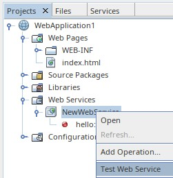
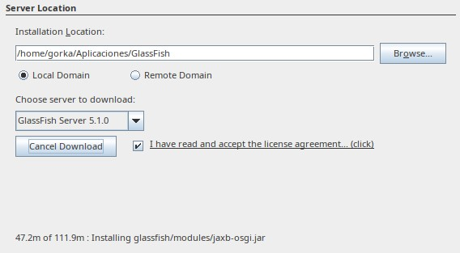

---

marp: true
size: 16:9
paginate: true
footer: (c) 2021 Gorka Prieto
style: |
    section {font-size: 18pt}
    section::before {content: "Tema 11: Servicios Web"};

---

Programación en Entornos Distribuidos{.h1}

Tema 11: Servicios Web{.h2}

<br/>

{.line}

<br/>

2º Ingeniería en Tecnología de Telecomunicación (UPV/EHU){.s3}

Curso 2020/2021{.s3}

---

Licencia de uso{.h1}

©2019-2021, Gorka Prieto Agujeta <<gorka.prieto@ehu.eus>>

Este documento está derivado de documentos anteriores desarrollados por Jon Matías y Javier del Ser.

Se otorga permiso para copiar, distribuir y/o modificar este documento bajo los términos de la Licencia de Documentación Libre de GNU en su versión 1.2 o cualquier otra versión posterior publicada por la Free Software Foundation, siendo todo él invariante. Una copia de la licencia está disponible en la web de la Free Software Foundation, dentro de la sección titulada GNU Free Documentation License.

[yes]: figs/yes.png
[no]: figs/no.png

---

Índice{.h1}

:::columns
@[toc]
:::

---

# Introducción

## ¿Qué son los servicios web?
- Otra tecnología para crear aplicaciones distribuidas
- Nivel de abstracción mayor que con sockets
- Protocolos y formatos estándares (W3C):
    - Interoperabilidad entre aplicaciones a través de la web
    - Mensajes de texto sobre **HTTP** (pasa los firewalls)

## Arquitectura Orientada a Servicios (SOA)
- Patrón de diseño de arquitectura
- Ofrece una API en forma de servicios web (paquete de dominio)
- Servicios autocontenidos, caja negra, pueden llamar a otros
- Independiente de plataforma y lenguaje de programación
- **Proveedor/consumidor**: los servicios "se consumen"


---

## Tipos de servicios web

- Servicios web **"grandes"** / **SOAP**:
    - Mensajes en formato **XML** (_Extensible Markup Language_)
    - Protocolo **SOAP** (_Simple Object Access Protocol_) sobre HTTP
    - Fichero **WSDL** (_Web Services Description Language_) con la descripción de los servicios
    - Registro **UDDI** (_Universal Description, Discovery, and Integration_) para descubrir servicios
    - API de Java EE: **JAX-WS**
- Servicios web **"ligeros"** / **RESTful**: 
    - Emplean directamente HTTP (métodos, cabeceras, etc.)
    - No mantienen estado
    - Sobrecarga mínima, más ligeros
    - Menor nivel de abstracción que los servicios SOAP
    - API de Java EE: **JAX-RS**

---

## Servidor de aplicaciones

- Nuestro código del proveedor se ejecuta **dentro de un servidor** web/aplicaciones (**JavaEE)**
- Ejemplos: **GlassFish**, JBoss/WildFly, Tomcat, Jetty, etc.
- Ofrece servicios a nuestra aplicación para que sea más sencilla:
    - HTTP, concurrencia, seguridad, etc.
- Ya no tenemos un `main()`, lo tiene el servidor
- Cuando modifiquemos el código hay que **publicarlo** en el servidor


---

# Tecnologías

## XML (eXtensible Markup Language)


- Lenguaje para descripción de datos con independencia de la plataforma
- Especificación desarrollada por el W3C
- Basado en etiquetas (_tags_):
    - Etiquetas propias
    - Librerías de etiquetas de terceros
- Permite definir lenguajes y su validación formal:
    - _schema_ XSD, DTD
- Interpretación de los datos entre aplicaciones

---

## SOAP (Simple Object Access Protocol)

-  Protocolo basado en XML para el intercambio de información entre aplicaciones:
    - Sobre HTTP o SMTP
- Estándar W3C
- Independiente de plataforma y lenguaje

---

## WSDL (Web Services Description Language)


- Estándar W3C basado en XML
- Localización del WS:
    - URL, puerto, etc.
- Descripción del WS:
    - No dice cómo está hecho el servicio, pero sí cómo interactuar con él.
    - Funciones, parámetros de E/S, etc.

---

## UDDI (Universal Description, Discovery and Integration)

- Servicio de directorio en donde las empresas pueden registrar y buscar Web Services
- Directorio de interfaces Web Service descritos mediante WSDL
- Se hace uso de SOAP para la comunicación con UDDI


---

# Implementación

## Proveedor JAX-WS

- En primer lugar hay que crear un **service endpoint**:
    - Declara los métodos que el cliente puede invocar remotamente
    - Se puede hacer mediante una **clase** y una interfaz
- Clase que va a ofrecer los servicios:
    - Anotada con `@javax.jws.WebService`
        - En caso de usar interfaz hay que indicarla con `endpointInterface`
    - Debe tener un **constructor por defecto** público
    - Los métodos de negocio deben ser **públicos** y no ~~static~~ ni ~~final~~
    - Los métodos de negocio deben tener la anotación `@javax.jws.WebMethod` para que sean expuestos al cliente

---

```java
package javaeetutorial.helloservice;

import javax.jws.WebService;
import javax.jws.WebMethod;

@WebService
public class Hello {
    private final String message = "Hello, ";

    public Hello() {
    }

    @WebMethod
    public String sayHello(String name) {
        return message + name + ".";
    }
}
```

:::note
https://docs.oracle.com/javaee/7/tutorial/jaxws001.htm
:::

---

## Consumidor

- A partir del código WSDL se puede generar **automáticamente** el código del cliente (`wsimport`)
- Clase (`HelloService_Service`) que representa el endpoint:
    ```java
    @WebServiceClient(name = "HelloService", targetNamespace = "http://ped.ehu.eus/", 
        wsdlLocation = "http://localhost:8080/Proveedor/HelloService?wsdl")
    public class HelloService_Service extends Service {
        @WebEndpoint(name = "HelloServicePort")
        public HelloService getHelloServicePort() { ... }
    }
    ```
- Se obtiene un intermediario (denominado **port**) con el servicio:
    - Implementa una interfaz (`HelloService`) con los métodos de negocio:
    ```java
        HelloService_Service service = new HelloService_Service();
        HelloService port = service.getHelloServicePort();
    ```
- Se llama a los métodos como si fuesen locales:
    ```java
    System.out.println( port.hello("Gorka") );
    ```

---

# Demo NetBeans

## Pasos en el servidor

:::columns
1. Crear proyecto tipo **Web Application**:
    

2. Elegir el servidor de aplicaciones **GlassFish**:
    
    - Contexto = ruta donde publicará la app

3. Añadir **Web Service**:
    

    
:::

---

:::columns
4. **Añadir operaciones** al servicio web según la teoría o usando la GUI:
    

5. **Ejecutar** proyecto desde NetBeans:
    1. Arranca GlassFish
    2. Publica (*deploy*) la aplicación
    3. Lanza un navegador para verla

6. **Probar** el servicio web desde el navegador:
    

    
:::

---

En caso de no tener instalado GlassFish lo puedes instalar y configurar desde el propio NetBeans en el paso 2:
:::columns





:::

---

## Pasos en el cliente

:::columns
1. Creamos proyecto de tipo **Java Application**
2. Añadimos un **cliente** de servicios web:
    
3. Indicamos la ubicación del **WSDL**:
    
4. Genera el código **automáticamente**:
    
5. *Drag & drop* del método sobre nuestro código:
    
:::

---

Referencias{.h1}

- https://docs.oracle.com/javaee/7/tutorial/webservices-intro.htm
- https://download.oracle.com/otn_hosted_doc/jdeveloper/1012/web_services/ws_c_wsconcepts.html
- https://javaee.github.io/metro-jax-ws/doc/user-guide/index.html
- https://netbeans.apache.org/kb/docs/websvc/jax-ws.html