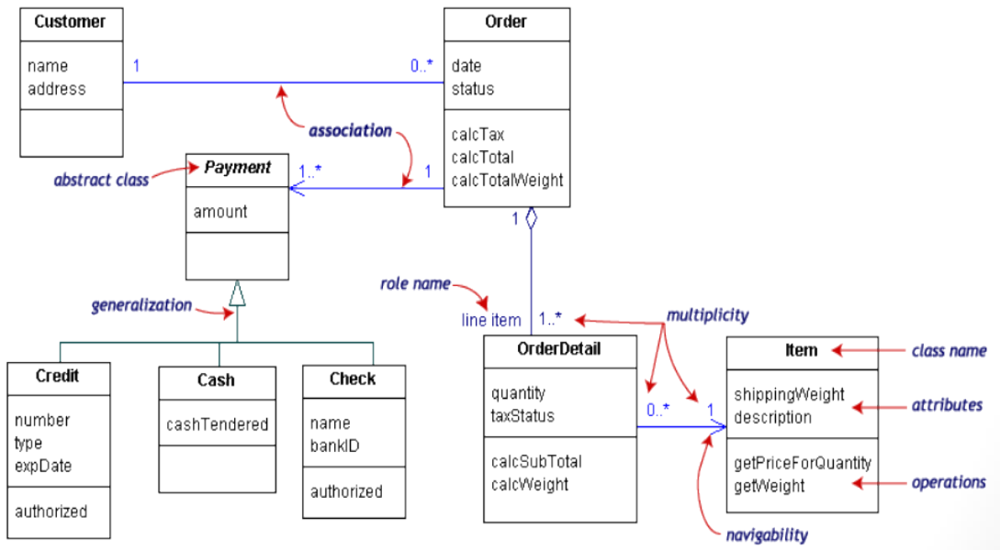
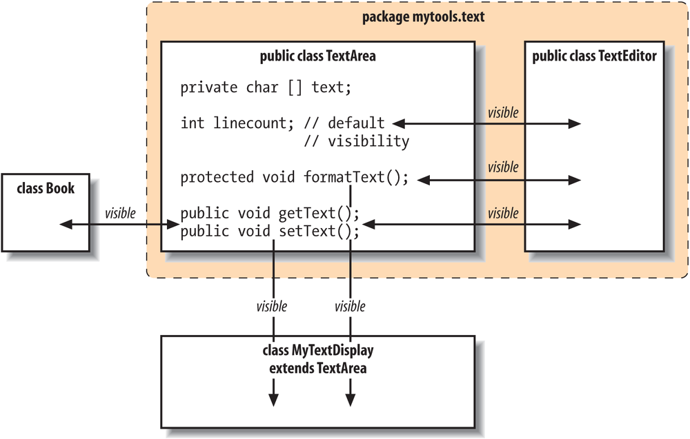
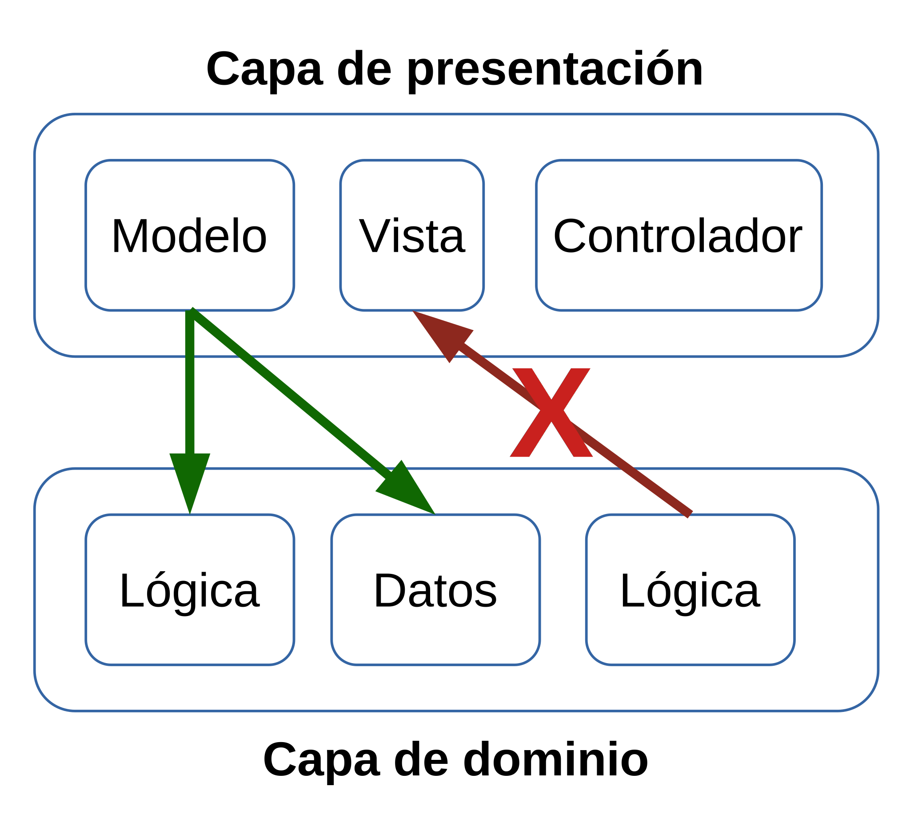
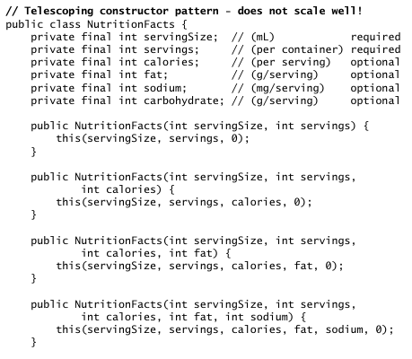
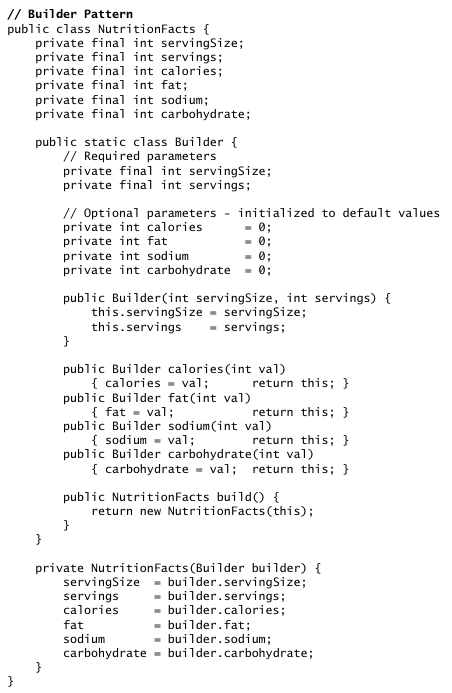

---

marp: true
size: 16:9
paginate: true
header: Tema 2: Clases y Objetos
footer: (c) 2020 Gorka Prieto
style: section {font-size: 18pt}

---

Programación en Entornos Distribuidos{.h1}

Tema 2: Clases y Objetos{.h2}

<br/>

{.line}

<br/>

2º Ingeniería en Tecnología de Telecomunicación (UPV/EHU){.s3}

Curso 2020/2021{.s3}

---

Licencia de uso{.h1}

©2019-2021, Gorka Prieto Agujeta <<gorka.prieto@ehu.eus>>

Este documento está derivado de documentos anteriores desarrollados por Jose Daniel Gutiérrez Porset, Gaizka Abaroa Erkoreka y Javier del Ser Lorente.

Se otorga permiso para copiar, distribuir y/o modificar este documento bajo los términos de la Licencia de Documentación Libre de GNU en su versión 1.2 o cualquier otra versión posterior publicada por la Free Software Foundation, siendo todo él invariante. Una copia de la licencia está disponible en la web de la Free Software Foundation, dentro de la sección titulada GNU Free Documentation License.

[yes]: figs/yes.png
[no]: figs/no.png

---

Índice{.h1}

:::columns
@[toc]
:::

---

# Introducción

## Clases vs objetos

- **Clase**:
    - Abstracción de las entidades que intervienen en el problema
    - Formada por los siguientes **miembros**:
        - **Atributos** ==> variables que representan las características de la clase
        - **Métodos** ==> operaciones que se pueden realizar sobre la clase
    - Ejemplo: Perro
        - Atributos ==> raza, color, peso, edad, etc.
        - Métodos ==> comer(), ladrar(), dormir(), correr(), etc.
- **Objeto**:
    - **Instancia** de una clase
    - Contiene valores concretos de los atributos
    - Ej.: `raza="labrador"`, `color="negro"`, `peso=20`, `edad=4`, etc.

---


:::note
Imagen tomada de https://www.guru99.com/java-oops-class-objects.html
:::

---

## Nomenclatura convenio

- Variables (_camelCase ya visto en el tema anterior_)
- Clases y objetos:
    - Las clases empiezan por letra mayúscula: `Perro`
    - Los atributos empiezan por minúscula (como las variables): `raza`
    - Los métodos empiezan por minúscula: `ladrar()`
    - Si más de una palabra se utiliza 'camel case':
        - Clase: `HolaMundo`
        - Método: `mostrarPantalla()`
        - Atributo: `nombreUsuario`
- Paquetes:
    - Todas las letras en minúscula
    - Se recomienda una única palabra, pero si hay varias se separan por '_'
    - Ejemplos: `ped`, `prog_ent_distrib`

---

## Diseño orientado a objetos

### Encapsulamiento y ocultación

- Empaquetar datos y métodos que operan sobre los mismos
- Restringir acceso a los miembros del objeto
    - Llamar a métodos para modificar o consultar los atributos en lugar de acceder a ellos directamente


---

### Diagramas de clases UML

- UML: _Unified Modeling Language_

:::columns
|clase|
|---|
|propiedades|
|métodos|


.{.break}


:::

:::note
- Públicos (+) o privados (-)
- Estáticos{.u}
:::

---

### Interacción entre clases



---

# Clases y objetos

## Definición de clases

1. Declaración de la clase:
    :::columns
    ```java
    class Alumno {
        // atributos, constructores y métodos
    }
    ```
    ```java
    public class Alumno {
        // atributos, constructores y métodos
    }
    ```
    :::
1. Declaración de atributos:
    :::columns
    ```java
    // Sin ocultación
    public String nombre;
    public int edad;
    ```
    ```java
    // Con ocultación
    private String nombre;
    private int edad;
    ```
    :::
2. Definición de métodos:
    ```java
    public void saluda() {
        System.out.println("Hola " + nombre);
    }
    ```

---

## Método main()

- **Público** y dentro de una clase pública (para poder llamarlo desde fuera del código)
- **Estático** (para poder llamarlo sin construir un objeto)
- De tipo **void** y toma como entrada un array de Strings con los **argumentos** pasados al llamarlo
- Se podría tener varios `main()` en clases diferentes, pero sólo se ejecutará el indicado en el comando `java`
- Mejor en un **clase propia** destinada a la ejecución
- El fichero java se tiene que **llamar igual** que la clase

```java
public class Aplicacion {
    public static void main(String[] args) {
        Alumno alumno = new Alumno("Jon", 20);
        alumno.saluda();
    }
}
```

---

<style scoped>
    li {margin: -15px;}
</style>

## Creación de objetos

### Constructor

- Método **constructor** definido en la propia clase
- Se debe llamar **igual** que la clase (incluidas mayúsculas)
- No tiene tipo de **retorno**, ni tan siquiera void, ya que siempre devuelve un objeto del mismo tipo de la clase donde se define    

- Puede tener cero o más parámetros y se puede sobrecargar
- Típicamente se emplea para inicializar los atributos en función de los argumentos recibidos

```java
public class Alumno {
    private final String nombre;
    private int edad;

    public Alumno(String n, int edad) {
        nombre = n;         // No hay ambigüedad
        this.edad = edad;   // Usamos this para resolver la ambigüedad
    }
}
```

---

### Consideraciones:

- El constructor se invoca anteponiendo la palabra reservada **new**:
    ```java
    Alumno alumno = new Alumno("Jon", 20);
    ```
- Todos los objetos son alojados en el **heap** (memoria dinámica) a diferencia de C++ que también puede alojarlos en la pila
- No existe un **~~destructor~~**, a diferencia de otros lenguajes como C++ (ej: `~Alumno()`)
- No hay que liberar la memoria reservada:
    - El recolector de basura (**_garbage collector_**) libera automáticamente las zonas de memoria no referenciadas por ninguna variable
    - Se puede ayudar al recolector haciendo que la variable apunte a **null** cuando ya no se necesite el objeto que referenciaba
- Si en la clase no se define ningún constructor, el sistema proporciona un **constructor por defecto** sin parámetros

---

### Ejemplo

:::columns
```java
public class Circulo {
    private int radio;
    private String color;

    public Circulo() {
    }

    public Circulo(int radio, String color) {
        this.radio = radio;
        this.color = color;
    }

    public int getRadio() {
        return radio;
    }

    public void setRadio(int radio) {
        if( radio >= 0 )
            this.radio = radio;
    }

    public String getColor() {
        return color == null ? "vacío" : color;
    }
```
```java
    public void muestra() {
        System.out.println("Círculo " + getColor() +
            " de radio " + getRadio());
    }

    public static void main(String[] args) {
        Circulo c1 = new Circulo();
        Circulo c2 = new Circulo(10, "rojo");

        c1.muestra();
        c2.muestra();

        c1.setRadio(20);
        c1.muestra();
    }
}
```
```shell
$ java Circulo.java
Círculo vacío de radio 0
Círculo rojo de radio 10
Círculo vacío de radio 20
```
:::

---

### Objeto actual (this)

- La palabra reservada **this** siempre referencia al objeto actual
- Puede utilizarse para resolver **ambigüedades**:
    ```java
    public Circulo(int radio, String color) {
        this.radio = radio;
        this.color = color;
    }
    ```
- Puede utilizarse para llamar a otro **constructor** de la misma clase
    - En este caso debe ser la ==primera línea del constructor==
    ```java
    public class Circulo {        
        public Circulo(int radio, String color) {
            this.radio = radio;
            this.color = color;
        }

        public Circulo(int radio) {
            this(radio, "negro");
        }
    }
    ```

---

<style scoped>
    header {display: none;}
    footer {display: none;}
</style>

## Miembros

### Atributos

- Los objetos almacenan información en sus atributos
- Atributos de **instancia**:
    - Copia diferente en cada objeto de la clase
    - Únicamente accesible a través del objeto
- Atributos de **clase**:
    - Se definen con el modificador **static**
    - Única copia compartida por todos los objetos de la clase
    - Accesible desde los objetos y desde la clase
    - Útiles como constantes añadiendo el modificador **final**

```java
public class Circulo {
    private static int numeroCirculos;

    public Circulo() {
        numeroCirculos++;
    }
}
```


---

<style scoped>
    header {display: none;}
    footer {display: none;}
</style>

### Métodos

:::columns
- Operan sobre los atributos del objeto
- Pueden recibir parámetros (_ver paso de parámetros_)
- Pueden ser de tipo void o devolver un único resultado con **return**
- Se pueden **sobrecargar**:
    - Firma = nombre + lista tipos params
    - No vale si sólo cambia el tipo de retorno!
- Pueden ser de instancia o de clase
- Los métodos de clase:
    - Se definen con el modificador **static**
    - No pueden utilizar la palabra reservada **~~this~~**
    - Sólo pueden acceder a **atributos static**

.{.break}

```java
class Circulo {
    private double radio = 5;
    private static final double PI = 3.1416;

    public Circulo(double radio) {
	    this.radio = radio;
    }
    
    public double getCircunferencia() {
        return getCircunferencia(radio);
    }

    public static double getCircunferencia(double r) {
        return 2 * r * PI;
    }

    public static void main(String[] args) {
        Circulo obj = new Circulo(10);
        System.out.println( obj.getCircunferencia() );
        System.out.println( Circulo.getCircunferencia(5) );
    }
}
```
```shell
$ java Circulo.java
62.832
31.416
```
:::

---

### Acceso

- Miembros de instancia:
    ```java
    obj.radio = 1.23;   // Atributo de instancia
    obj.calculaArea();  // Método de instancia
    ```
- Miembros de clase:
    ```java
    Circulo.PI;                 // Atributo de clase
    Circulo.calculaArea(3.21);  // Método de clase
    ```
- Modificadores de acceso para miembros de la clase:
    - **public**: accesible desde cualquier lugar en que la clase sea accesible
    - **protected**: accesible por subclases y por clases del mismo paquete
    - **_default_** (no poner nada): accesible por clases del mismo paquete
    - **private**: accesible sólo a miembros de la clase

---

|modificador|clase|paquete|subclase|mundo|
|---|:---:|:---:|:---:|:---:|
|public|![][yes]|![][yes]|![][yes]|![][yes]|
|protected|![][yes]|![][yes]|![][yes]|![][no]|
|_default_|![][yes]|![][yes]|![][no]|![][no]|
|private|![][yes]|![][no]|![][no]|![][no]|


---



---

## Paso de parámetros a métodos

- Argumentos de tipos **primitivos**:
    - Se pasa una **copia** de su valor
    - Si se modifica la variable del método, la variable de fuera no se verá afectada
- Argumentos de tipo **referencia**:
    - Se pasa una copia de la **dirección** del objeto
    - Si se modifica el objeto desde la variable del método, la variable de fuera también lo verá **modificado** porque ==¡ambas variables trabajan sobre el mismo objeto!==
- Parámetro de **retorno**:
    - Puede no devolver nada (void) o un único valor
    - Para devolver más de un valor habría que emplear arrays o encapsularlos en un nuevo objeto

---

<style scoped>
code {
    font-size: 11pt;
}
table {
    font-size: 13pt;
    position: absolute;
    left: 0;
    top: 50px;
    right: 0;
    bottom: 0;
}

th {
    font-weight: normal;
}
</style>

|**Tipo**                   |**Número**|**Entrada**                 |**Salida**                 |**Entrada/salida**                 | \
|                           |      |Valor antes de llamar a `metodo()`|`metodo()` les da un valor|Valor antes y `metodo()` lo puede cambiar|
|---------------------------|------|--------------------------------|---------------------------|-----------------------------------|
|**Primitivo**              |Uno   |```java                         |```java                    |```java                            | \
|(int, ...)                 |      |int num = 3;                    |int num;                   |int num = 3;                       | \
|                           |      |metodo(num);                    |num = metodo();            |num = metodo(num);                 | \
|                           |      |```                             |```                        |```                                |
|^^                         |Varios|```java                         |```java                    |```java                            | \
|                           |      |int alto = 3, ancho = 4;        |int alto, ancho;           |int alto = 3, ancho = 4;           | \
|                           |      |metodo(alto, ancho);            |Rect rect;                 |Rect rec = new Rect(alto, ancho);  | \
|                           |      |```                             |rect = metodo();           |metodo(rect);                      | \
|                           |      |                                |alto = rect.alto;          |alto = rect.alto;                  | \
|                           |      |                                |ancho = rect.ancho;        |ancho = rect.ancho;                | \
|                           |      |                                |```                        |```                                |
|**Referencia**             |Uno   |```java                         |```java                    |```java                            | \
|(objetos)                  |      |Rect rect = new Rect(3, 4);     |Rect rect;                 |Rect rect = new Rect(3, 4);        | \
|                           |      |metodo(rect);                   |rect = metodo();           |metodo(rect);                      | \
|                           |      |```                             |```                        |```                                |
|^^                         |Varios|```java                         |```java                    |```java                            | \
|                           |      |Rect rect1 = new Rect(2, 3);    |Rect rect1 = new Rect();   |Rect rect1 = new Rect(2, 3);       | \
|                           |      |Rect rect2 = new Rect(3, 4);    |Rect rect2 = new Rect();   |Rect rect2 = new Rect(3, 4);       | \
|                           |      |metodo(rect1, rect2);           |metodo(rect1, rect2);      |metodo(rect1, rect2);              | \
|                           |      |```                             |```                        |```                                |
|^^                         |      |```java                         |```java                    |```java                            | \
|                           |      |/*alto y ancho final o metodo() |/*metodo() debe rellenarlos|/*metodo() supone valores válidos  | \
|                           |      |no debería cambiarlos*/         |con valores válidos*/      |y puede cambiarlos*/               | \
|                           |      |```                             |```                        |```                                |

---

# Patrones de diseño

## Introducción

- Soluciones reutilizables a problemas comunes
- Ventajas:
    - Buenas prácticas
    - No reinventar la rueda
    - Más fácil entender código de otros
- Muchos tipos:
    - Creación de objetos: factory, builder, singleton, etc.
    - Estructurales: composite, adapater, etc.
    - Comportamiento: iterator, observer, etc.
    - Arquitectura: niveles, capas, módulos, presentación separada: MVC, MVP, MVVM, etc.


---

## Estructurales

### Propiedades

- Métodos que permiten acceder de forma controlada al estado de la clase
- En Java se implementan mediante métodos **_setter_** y **_getter_**
    ```java
    public class Circulo {
        // Propiedad "radio" de lectura y escritura
        public void setRadio(double radio) {...}
        public double getRadio() {...}

        // Propiedad "area" de sólo lectura
        public double getArea() {...}
    }
    ```
- Pueden basarse en atributos, pero no es necesario, sólo tener un **getter**:
    - La clase `Circulo` tiene un atributo `radio`, pero no `area` ya que sería redundante (se calcula a partir del radio)
- El IDE permite generar automáticamente los _getters_ y _setters_ a partir de los atributos

---

<style scoped>
.break {break-after: column;}
</style>

:::columns
### JavaBeans
- Componentes reutilizables
- Encapsulan varios objetos dentro de otro
- Características:
    - Constructor sin argumentos (puede haber otros adicionales)
    - Atributos privados
    - Propiedades con getters/setters (nomenclatura estándar)
    - Serializable

.{.break}

```java
public class Circulo {
    private int radio;
    private String color;

    public Circulo() {
    }

    public Circulo(int radio, String color) {
        this.radio = radio;
        this.color = color;
    }

    public Circulo(int radio) {
        this(radio, "negro");
    }

    public int getRadio() {
        return radio;
    }

    public void setRadio(int radio) {
        if( radio >= 0 )
            this.radio = radio;
    }

    public String getColor() {
        return color == null ? "vacío" : color;
    }

    // ...
}
```
:::

---

<style scoped>
footer {display: none;}
.note {
    bottom: 0;
}
</style>

## Arquitectura

- Módulo:
    - Contiene todo lo necesario para ejecutar una funcionalidad de forma independiente
    - Paquete Java con varias clases
- Capa:
    - Conjunto de módulos reutilizable
    - Arquitecturas multicapa: presentación, negocio, datos, etc.
    - Pila de capas: cada capa depende de la de abajo pero no de la de arriba
- Presentación separada:
    - Capa de **presentación** encargada de E/S con el usuario
    - Capa de **dominio** encargada de datos y lógica



:::note
https://en.wikipedia.org/wiki/Multitier_architecture#Layers
https://martinfowler.com/eaaDev/SeparatedPresentation.html
:::

---

## Construcción

### Singleton

- Única instancia compartida a lo largo de todo el código
- No abusar (antipattern)

```java
// Singleton with public final field
public class Elvis {
    public static final Elvis INSTANCE = new Elvis();
    private Elvis() {...}

    public void leaveTheBuilding() {...}
}
```

:::note
Joshua Bloch, “Effective Java”. Third Edition, 2018.
:::

---

<style scoped>
footer {display: none;}
header {display: none;}
code {font-size: 9pt;}
</style>

:::columns
### Builder

- Objeto que ayuda a construir otro objeto
- Evita "constructores telescópicos"


```java
NutritionFacts cocaCola =
    new NutritionFacts(240, 8, 100, 0, 35, 27);
```

```java
NutritionFacts cocaCola =
    new NutritionFacts.Builder(240, 8)
    .calories(100).sodium(35).carbohydrate(27)
    .build();
```


:::

---

### Factory

- Método estático que construye el objeto
- Ventajas:
    - Tiene un nombre, puede reutilizar objetos, más flexibles (subclases, etc.)
- Nombres habituales:
    - `from()`, `of()`, `valueOf()`, `instance()`/`getInstance()`, `create()`/`newInstance()`, `getType()`, `newType()`, `type()` 

```java
public static Boolean valueOf(boolean b) {
    return b ? Boolean.TRUE : Boolean.FALSE;
}
```

---

## Resumen

- Los patrones de diseño nos ayudan a seguir buenas prácticas de programación
- Un patrón de diseño de estructura para el encapsulamiento y ocultación en Java son los beans, que emplean propiedades (_getters_ y _setters_)
- Algunos patrones de diseño para la construcción de objetos son builder, factory y singleton 
- En el patrón de diseño de presentación separada separamos la presentación (E/S usuario) del dominio (datos y lógica)