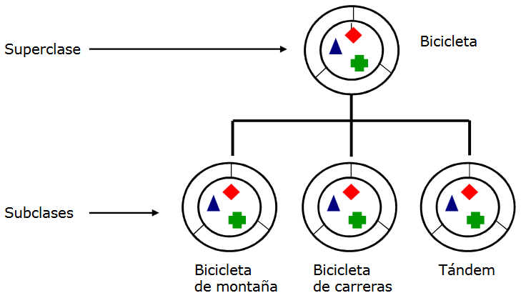
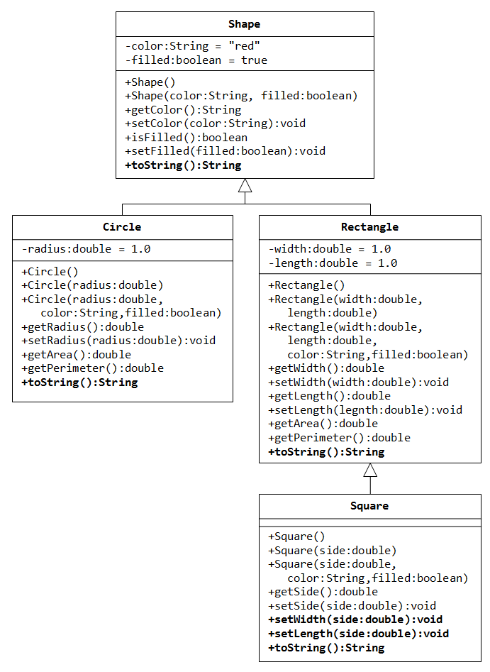
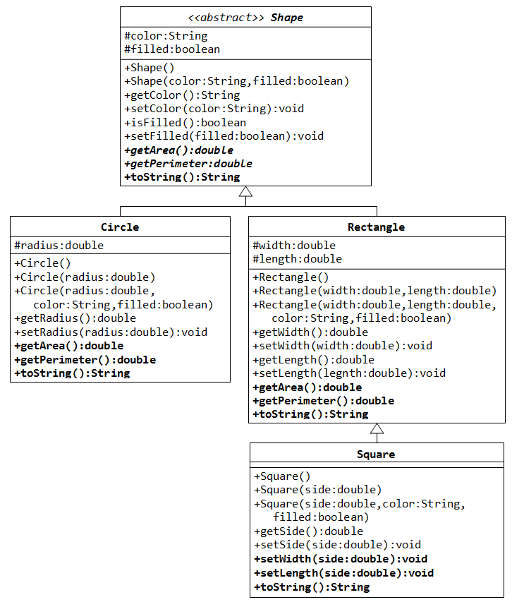
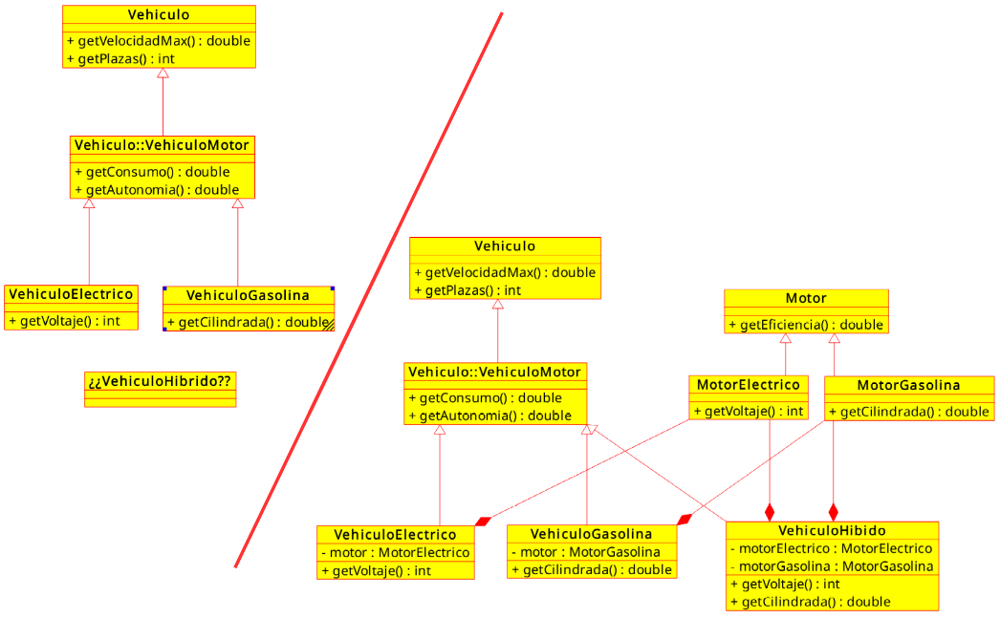

---

marp: true
size: 16:9
paginate: true
footer: © 2022 Gorka Prieto
style: |
    section {font-size: 18pt}
    section::before {content: "Tema 4: Herencia y Composición"};

---

Programación en Entornos Distribuidos{.h1}

Tema 4: Herencia y Composición{.h2}

<br/>

{.line}

<br/>

2º Ingeniería en Tecnología de Telecomunicación (UPV/EHU){.s3}

Curso 2021/2022{.s3}

---

Licencia de uso{.h1}

© 2019-2022, Gorka Prieto Agujeta <<gorka.prieto@ehu.eus>>

Este documento está derivado de documentos anteriores desarrollados por Jose Daniel Gutiérrez Porset, Gaizka Abaroa Erkoreka y Javier del Ser Lorente.

Se otorga permiso para copiar, distribuir y/o modificar este documento bajo los términos de la Licencia de Documentación Libre de GNU en su versión 1.2 o cualquier otra versión posterior publicada por la Free Software Foundation, siendo todo él invariante. Una copia de la licencia está disponible en la web de la Free Software Foundation, dentro de la sección titulada GNU Free Documentation License.

[yes]: figs/yes.png
[no]: figs/no.png

---

Índice{.h1}

@[toc]

---

<style scoped>    
    footer {display: none;}
    .note {bottom: 0px;}
</style>

# Introducción
## Conceptos

- Capacidad de una clase para definirse en términos de otra clase heredando atributos y métodos
- Uno de los aspectos característicos del paradigma POO
- Mecanismo que, bien utilizado^1^, facilita la modificación y reutilización del código
- Dos tipos de clases:
    - Clase padre/madre, superclase o clase base
    - Clase hija, subclase o clase derivada:
        - Hereda atributos y métodos de la primera
        - Define sus propias diferencias
- Un objeto de la clase hija es también de tipo clase padre (polimorfismo)



:::note
^1^ Ver apartado de composición al final del tema
:::

---

<style scoped>
    header {display: none;}
    footer {display: none;}
</style>

## Ventajas e inconvenientes

- Ventajas:
    - Se ahorra código
    - Permite reutilizar código extendiendo su funcionalidad
- Desventajas:
    - Se introduce una fuerte dependencia en la clase hija respecto a la clase padre
    - Puede dificultar la reutilización
    - Un cambio en la clase padre puede tener efectos imprevistos en las clases hijas
    - Un objeto de una clase hija puede tener un comportamiento inconsistente con lo esperado de un objeto de la clase padre
    - Se establece una jerarquía o clasificación. Si cambia el criterio de clasificación puede acarrear muchas modificaciones
- No hay receta mágica para crear buenas jerarquías!!!


---

# Herencia

## Llamada a métodos

- Llamada a un método de la clase = 'paso de mensaje'
- La herencia modifica este mecanismo
- Si se llama a un método `M` de una a través de una variable de tipo clase `C`:
    1. Si existe el método `M` en la clase `C` se ejecuta ese método y termina el proceso
    1. Si en la clase `C` no existe ese método, se busca en la superclase de `C`:
        1. Si en la superclase de `C` existe el método `M`, se ejecuta y se termina el proceso
        1. Si no existe, se continua buscando en la superclase de la superclase hasta que se encuentre o se produzca un error

---

## Sintaxis

- Se emplea la palabra reservada `extends` en la definición de la clase:
    ```java
    public class MountainBike extends Bicycle {
        // Nuevos atributos y métodos
    }
    ```
- Una clase **sólo** puede heredar de **una** superclase (a diferencia de otros lenguajes como C++):
    - Evita situaciones de conflicto (herencias virtuales, etc.)
    - Se puede solucionar con interfaces y/o composición
- Se puede acceder a los miembros de la superclase empleando la palabra reservada `super`:
    - Permite resolver ambigüedades al igual que ocurría con `this`
- Si una clase se declara como `final`, no se puede heredar de ella:
    ```java
    public final class Constantes {
        public static final double PI = 3.14159;
    }
    ```

---

## Visibilidad

- Se heredan todos los miembros respetando modificadores de acceso:
    - Los miembros **privados** de la superclase no se heredan y no son visibles en la subclase
    - Los miembros **públicos** siguen siendo públicos en la subclase
    - Los miembros **protegidos** son visibles sólo para las subclases y clases del mismo paquete
    - Al heredar se puede **aumentar la visibilidad** de los miembros, pero nunca reducirla

|modificador|clase|paquete|subclase|mundo|
|---|:---:|:---:|:---:|:---:|
|public|![][yes]|![][yes]|![][yes]|![][yes]|
|protected|![][yes]|![][yes]|![][yes]|![][no]|
|_default_|![][yes]|![][yes]|![][no]|![][no]|
|private|![][yes]|![][no]|![][no]|![][no]|

---

## Sobrescritura

- La sobrescritura (**_override_**) consiste en crear en la clase hija un método con el mismo nombre y parámetros que otro de la clase padre:
    - Recomendable decorar con `@Override`
    - No confundir con sobrecarga (**_overload_**) ==> mismo nombre pero diferentes parámetros
- Atributos:
    - Aunque tengan el mismo nombre no se sobrescriben, **cada clase accede al suyo**
    - Si se quiere acceder al de la superclase se puede emplear `super.atributo`
- Métodos:
    - **Se llama al de la clase del objeto**, aunque la variable sea de tipo superclase
    - Reemplazo (**_overwrite_**): substituir completamente la implementación del método heredado
    - Refinamiento (**_refinement_**): añadir nueva funcionalidad al método heredado:
        - Desde la clase hija se llama al método de la clase padre con `super.metodo()` en la nueva implementación
    - Si un método se declara `final` no se puede sobrescribir

---

### Ejemplo básico

:::autocols

```java
public class Base {
    public void saluda(String nombre) {
        System.out.println("Hola " + nombre);
    }
}
```

```java
public class Derivada extends Base {

    @Override
    public void saluda(String nombre) {
        super.saluda(nombre);
        System.out.println(
            "Hoy va a hacer sol");
    }


    public void despide() {
        System.out.println("¡Adiós!");
    }
}
```

```java
public class EjemploBasico {

    public static void main(String[] args) {
        Derivada obj = new Derivada();

        obj.saluda("Gorka");
        obj.despide();
    }

}
```

:::

---

## Constructores

- Tienen un tratamiento especial en comparación con los métodos normales
- El constructor no se hereda, pero el de la clase hija refina el de la clase padre
- La primera sentencia del constructor de la clase hija siempre es una llamada al constructor de la clase padre
    - De forma explícita:
        - Mediante `super()`
        - Se llamará a un constructor u otro dependiendo de los argumentos
    - De forma implícita:
        - Si se omite se llama al constructor por defecto de la clase padre (equivalente a `super()`)
        - Si no existe constructor por defecto en la clase padre dará error de compilación
- Se puede llamar a otro constructor de la misma clase:
    - Mediante `this()`, y entonces el que hará el `super()` será el otro constructor
    - No se puede poner `this()` y `super()` a la vez en el mismo constructor
    
---

### Ejemplo

:::autocols
```java
class Padre {
    Padre(String nombre) {
        System.out.println(
            "Constructor de la clase Padre: "
            + nombre);
    }
}

class Hija extends Padre {
    Hija() {
        super("Desde la Hija");
        System.out.println(
            "Constructor de la clase Hija");
    }
}

class Nieta extends Hija {
    Nieta() {
        //super();
        System.out.println(
            "Constructor de la clase Nieta");
    }
}

public class Constructores {
    public static void main(String[] args) {
        new Nieta();
    }
}
```
.{.break}
```shell
Constructor de la clase Padre: Desde la Hija
Constructor de la clase Hija
Constructor de la clase Nieta
```
:::

---

## Clase Object

- En java todas las clases heredan de forma **implícita** de la clase Object
- Es la clase **raíz** de todo el árbol de jerarquía
- Proporciona métodos de utilidad general que tendrán todos los objetos y que se pueden sobrescribir:
    - Comparar si dos objetos son iguales:
        ```java
        public boolean equals( Object obj );
        public int hashCode();  // Coherente
        ```
    - Representar el objeto como una cadena:
        ```java
        public String toString();
        ```
    - etc.


---

### Ejemplo

:::autocols

```java
public class Alumno {
    private final String DNI;
    private final String nombre;

    public Alumno(String DNI, String nombre) {
        this.DNI = DNI;
        this.nombre = nombre;
    }

    @Override
    public String toString() {
        return "Soy " + nombre;
    }

    @Override
    public boolean equals(Object obj) {
        if( obj instanceof Alumno )
            return DNI.equals(((Alumno)obj).getDNI());
        else
            return super.equals(obj);
    }

    @Override
    public int hashCode() {
        return DNI.hashCode();
    }

    // getters
}
```

```java
public class EjemploObject {

    public static void main(String[] args) {
        // Caso 1
        Alumno a1 = new Alumno("11111111", "Jon");
        System.out.println(a1);        

        // Caso 2
        Alumno a2 = new Alumno("11111111", "Jon");
        if( a1 == a2 )
            System.out.println("Mismo alumno");
        else
            System.out.println("Distinto alumno");

        // Caso 3
        if( a1.equals(a2) )
            System.out.println("Mismo alumno");
        else
            System.out.println("Distinto alumno");
    }

}
```

:::

---

## Jerarquía

- Ejemplo de figuras geométricas
- La clase base proporciona métodos comunes (color)
- Cada hija sus propiedades específicas (radio, anchura, etc.)
- Algunas propiedades comunes no se pueden poner en la clase base porque aún no se conocen^1^ (área, perímetro)
- En negrita métodos sobrescritos

:::note
^1^ Volveremos a ello con las clases abstractas en el siguiente apartado
:::



---

<style scoped>
    footer {display: none;}
</style>

## Abstracción

- A veces interesa clase base sólo para ser extendida:
    - Indicar métodos sin llegar a implementarlos
    - No permitir crear objetos, sólo de las hijas
- Aquellos métodos que no interesa implementar se declaran como abstractos:
    ```java
    public abstract double getArea();
    ```
    - La clase hija tiene que implementar todos o será también abstracta
- Si una clase tiene algún método abstracto entonces es abstracta:
    ```java
    public abstract class Shape {...}
    ```
    - No se pueden crear objetos de esta clase
- Si todos los métodos son abstractos es mejor usar interfaces (_siguiente tema_)



---

### Ejemplo

:::autocols

```java
public abstract class Forma {
    private String color;

    public String getColor() {
        return color;
    }

    public void setColor(String color) {
        this.color = color;
    }

    public abstract double getPerimeter();
}


public class EjemploAbstract {

    public static void main(String[] args) {
        // Error
        //Forma forma = new Forma();

        // OK
        Rectangulo rect = new Rectangulo(2, 3);
        System.out.println(rect.getPerimeter());
    }

}

```

```java
public class Rectangulo extends Forma {
    private int alto, ancho;

    public Rectangulo(int alto, int ancho) {
        this.alto = alto;
        this.ancho = ancho;
    }

    public int getAlto() {
        return alto;
    }

    public void setAlto(int alto) {
        this.alto = alto;
    }

    public int getAncho() {
        return ancho;
    }

    public void setAncho(int ancho) {
        this.ancho = ancho;
    }

    @Override
    public double getPerimeter() {
        return 2*alto + 2*ancho;
    }

}
```

:::

---

# Composición

- Composición vs herencia:
    - Contener instancias de otras clases que realizan la funcionalidad
    - Relación _has-a_ vs _is-a_
    - En caso de duda favorecer composición
- Ventajas:
    - Flexibilidad → unir varios componentes en lugar de tratar de encontrar una jerarquía
    - Robustez de su interfaz frente a cambios en la clase base (las clases hijas son más "frágiles")
    - Más fácil cambiar la interfaz de la clase hija
    - Posibilidad retrasar creación del objeto
- Inconvenientes:
    - Métodos delegados (aunque ayuda el IDE, `@Delegate`, etc.)
    - Rendimiento (depende de la JVM)
    - Polimorfismo (se puede conseguir con interfaces)

---

### Ejemplo

:::autocols

```java
public class Telefono {
    private String numero;

    public String getNumero() {
        return numero;
    }

    public void setNumero(String numero) {
        this.numero = numero;
    }   
}


public class EjemploComposicion {

    public static void main(String[] args) {
        Contacto c = new Contacto();
        c.setNombre("Jon");
        c.getMovil().setNumero("666777888");
        c.getFijo().setNumero("9451234565");
        System.out.println(c.getNumero());
    }

}
```

```java
public class Contacto {
    private String nombre;
    private String direccion;
    private final Telefono movil = new Telefono();
    private final Telefono fijo = new Telefono();
    private Telefono telefono = movil;

    // getters y setters

    public Telefono getFijo() {
        return fijo;
    }

    public Telefono getMovil() {
        return movil;
    }

    public void setLlamada(boolean usarMovil) {
        telefono = usarMovil ? movil : fijo;
    }

    // Método delegado
    public String getNumero() {
        return telefono.getNumero();
    }

}
```

:::

---

<style scoped>
    .h2 {
        text-align: right;
        top: 100px;
    }
    section {
        justify-content: start;
    }
</style>

Herencia vs composición{.h2}


