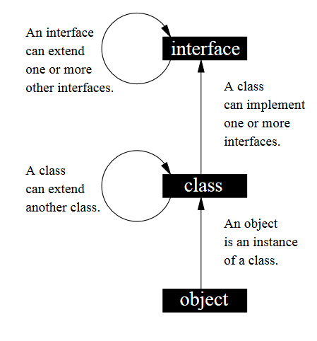

---

marp: true
size: 16:9
paginate: true
footer: (c) 2022 Gorka Prieto
style: |
    section {font-size: 18pt}
    section::before {content: "Tema 5: Interfaces y Polimorfismo"};

---

Programación en Entornos Distribuidos{.h1}

Tema 5: Interfaces y Polimorfismo{.h2}

<br/>

{.line}

<br/>

2º Ingeniería en Tecnología de Telecomunicación (UPV/EHU){.s3}

Curso 2021/2022{.s3}

---

Licencia de uso{.h1}

©2019-2022, Gorka Prieto Agujeta <<gorka.prieto@ehu.eus>>

Este documento está derivado de documentos anteriores desarrollados por Jose Daniel Gutiérrez Porset, Gaizka Abaroa Erkoreka y Javier del Ser Lorente.

Se otorga permiso para copiar, distribuir y/o modificar este documento bajo los términos de la Licencia de Documentación Libre de GNU en su versión 1.2 o cualquier otra versión posterior publicada por la Free Software Foundation, siendo todo él invariante. Una copia de la licencia está disponible en la web de la Free Software Foundation, dentro de la sección titulada GNU Free Documentation License.

[yes]: figs/yes.png
[no]: figs/no.png

---

Índice{.h1}

@[toc]

---

<style scoped>
footer {display: none;}
</style>

# Interfaces

## Introducción

:::autocols
- Necesidad:
    - En Java no se puede heredar de más de un clase
    - Las interfaces son como las clases abstractas puras pero donde se puede "heredar" (**implementar**) más de una
- Características:
    - Se declaran como `interface` en vez de como `class`
    - Todos sus métodos son abstractos y públicos, no es necesario indicarlo explícitamente
    - Todos sus atributos son constantes (`public static final`) por defecto
    - Definen un **contrato** con quien la implementa
    - Las variables de tipo interfaz pueden referenciar objetos de cualquier clase que implemente la interfaz (polimorfismo)

|         |Interfaz       |Clase abstracta       |
|---------|---------------|----------------------|
|Atributos|Sólo constantes|Constantes y variables|
|Métodos  |Abstractos     |Abstractos y/o concretos|
:::

---

## Herencia e interfaces

- Una interfaz:
    - Puede heredar (`extends`) de una o varias interfaces
    - No puede heredar de una clase
- Una clase:
    - Puede heredar (`implements`) de una o varias interfaces
    - Puede heredar de una clase (`extends`) y a la vez implementar una o varias interfaces (`implements`)
        - En este caso necesario poner primero el `extends` y por último el `implements`
    - Si no implementa todos los métodos de la interfaz tiene que declararse como `abstract`



---

## Ejemplo

:::autocols
```java
public class Coche {
    private String modelo;
    private String motor;

    public String getModelo() {
        return modelo;
    }

    public void setModelo(String modelo) {
        this.modelo = modelo;
    }

    public String getMotor() {
        return motor;
    }

    public void setMotor(String motor) {
        this.motor = motor;
    }
}
```
```java
public interface Alquilable {
    String getOficina();
    int getDias();
}
```
```java
public interface Asegurable {
    String getTomador();
    double getFranquicia();
}
```
:::

---

```java
public class CocheAlquiler
    extends Coche implements Alquilable, Asegurable {

    @Override
    public String getOficina() {
        return "...";
    }

    @Override
    public int getDias() {
        return 0;
    }

    @Override
    public String getTomador() {
        return "...";
    }

    @Override
    public double getFranquicia() {
        return 0.0;
    }
    
}
```


---

# Polimorfismo

## Introducción

- Misma "interfaz" para utilizar entidades de diferentes tipos ==> múltiples formas
- Se implementa mediante _métodos virtuales_:
    - Caso por defecto en Java (métodos no estáticos)
    - El método a invocar se enlaza de forma **dinámica** (tiempo de ejecución):
        - Se llama al método correspondiente al tipo de objeto referenciado
        - No al método correspondiente al tipo de la variable empleada

---

### Ejemplo

```java
// Variable de tipo forma referencia a
// objeto de tipo Circulo
Forma forma = new Circulo(1.3);

// Desde forma obtengo el área del círculo
System.out.println(forma.getArea());

// Pero desde forma no puedo obtener el radio
System.out.println(forma.getRadio()); // ERROR

// Y ahora usando la misma variable forma
// referencio a un rombo
forma = new Rombo(2);

// Y visualizo el área del rombo
System.out.println(forma.getArea());
```

- A `forma` no le importa qué objeto referencia mientras que tenga el método `getArea()` (y `getColor()`)


---

## Mecanismos

- Herencia:
    - Válido para clases en una misma jerarquía
    - Desde una variable de tipo clase padre se puede referenciar un objeto de tipo clase hija
- Interfaces:
    - Válido para clases en diferentes jerarquías
    - Desde una variable de tipo interfaz se puede referenciar un objeto de cualquier clase que implemente la interfaz

---

## Ejemplo con Herencia: Object

<div class="cols"><div>

```java
public class ArrayObject {
    private Object[] array;

    public void add( Object elemento ) {
        // ...
    }

    public Object get( int posicion ) {
        return array[posicion];
    }
}
```

</div><div>

```java
public static void main(String[] args) {
    // Lo uso con String
    ArrayObject arrayString =
        new ArrayObject();
    arrayString.add("Hola");
    arrayString.add("Prueba");

    // Lo uso con Alumno
    ArrayObject arrayAlumno =
        new ArrayObject();
    arrayAlumno.add(
        new Alumno("Jon", 20));
    arrayAlumno.add(
        new Alumno("Jane", 22));
    System.out.printf("Elemento #0: %s\n",
        // Necesario casting para métodos propios
        ((Alumno)arrayAlumno.get(0)).getNombre());

    // Nada impide "mezclar" distintos tipos ...
    arrayAlumno.add("Gorka");
}
```

</div></div>

---

## Ejemplo con Interfaces: Orquesta

1. Primero definimos la interfaz común a cualquier instrumento de la orquesta:

```java
public interface Instrumento {
    String getTipo();
    String suena();
}
```

2. A continuación hacemos que los diferentes instrumentos implementen esta interfaz:

<div class="cols"><div>

```java
public class Flauta implements Instrumento {
    @Override
    public String getTipo() {
        return "viento";
    }

    @Override
    public String suena() {
        return "flauteando";
    }  
}
```

</div><div>

```java
public class Tambor implements Instrumento {
    @Override
    public String getTipo() {
        return "percusión";
    }

    @Override
    public String suena() {
        return "pom pom";
    }   
}

// Lo mismo para Guitarra, Piano, etc.
```

</div></div>

---

3. Y ahora gracias al polimorfismo tocamos todos los instrumentos de la orquesta sin necesidad de saber cómo funciona cada uno:

:::autocols
```java
public class Instrumentos {
    public static void main(String[] args) {
        Instrumento[] orquesta = new Instrumento[5];
        creaOrquesta(orquesta);
        suena(orquesta, "cuerda");
    }

    private static void creaOrquesta(
            Instrumento[] o) {
        o[0] = new Guitarra();
        o[1] = new Piano();
        o[2] = new Flauta();
        o[3] = new Tambor();
        o[4] = new Guitarra();
    }

    private static void suena(
            Instrumento[] orquesta, String tipo) {

        for( Instrumento i : orquesta )
            if( i.getTipo().equals(tipo) )
                System.out.println(i.suena());
    } 
}
```

Y la salida por pantalla:

```shell
guitarreando
pianeando
guitarreando
```
:::