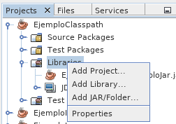

---

marp: true
size: 16:9
paginate: true
footer: (c) 2021 Gorka Prieto
header: Tema 7: Paquetes y API
style: |
    section {font-size: 18pt}
    section::before {content: "Tema 7: Paquetes, API y Colecciones"};

---

Programación en Entornos Distribuidos{.h1}

Tema 7: Paquetes, API y Colecciones{.h2}

<br/>

{.line}

<br/>

2º Ingeniería en Tecnología de Telecomunicación (UPV/EHU){.s3}

Curso 2020/2021{.s3}

---

Licencia de uso{.h1}

©2019-2021, Gorka Prieto Agujeta <<gorka.prieto@ehu.eus>>

Este documento está derivado de documentos anteriores desarrollados por Jose Daniel Gutiérrez Porset, Gaizka Abaroa Erkoreka y Javier del Ser Lorente.

Se otorga permiso para copiar, distribuir y/o modificar este documento bajo los términos de la Licencia de Documentación Libre de GNU en su versión 1.2 o cualquier otra versión posterior publicada por la Free Software Foundation, siendo todo él invariante. Una copia de la licencia está disponible en la web de la Free Software Foundation, dentro de la sección titulada GNU Free Documentation License.

[yes]: figs/yes.png
[no]: figs/no.png

---

Índice{.h1}

:::columns
@[toc]
:::

---

# Paquetes

## Introducción

- Conjunto de tipos (clases, interfaces, etc.) relacionados y que se agrupan por varios motivos:
    - Mantenimiento: **separación** de módulos/capas/etc., reutilización, protección acceso, etc.
    - **Espacios de nombres**: evitar conflictos con identificadores repetidos.
- Equiparable al concepto de **librería** en C.

- **Identificadores** formados por palabras separadas por puntos:
    - Por convenio en minúsculas
        - Ej: `java.applet`
    - Para paquetes propios recomendable URL al revés:
        - Ej: `eus.ehu.ped`
- Se pueden **anidar** formando jerarquías:
    - `java.awt`: paquete general del interfaz gráfico awt
    - `java.awt.color`, `java.awt.image`,...: otros paquetes de la jerarquía

---

<style scoped>
    img {float:right;}
    section {
        display: block;
        padding-top: 50px;
    }
</style>

## Directorios y ficheros


- Se corresponden con directorios en el sistema de ficheros:
    - Nombre del directorio igual al del paquete
    - Cada subpaquete (`.`) corresponde con un subdirectorio (`/`)
        `eus.ehu.ped` ==> `eus/ehu/ped`
- En cada directorio estarán los ficheros `*.class` correspondientes al paquete
- Si dentro de un directorio se crea un subdirectorio se dice que los paquetes están anidados:
    - Ej. el paquete `ped` dentro del paquete `eus.ehu`
    - Jerarquías de paquetes
- El paquete (con todos sus ficheros y subdirectorios) se puede distribuir como un único fichero `.jar`
    - Es simplemente un fichero comprimido en formato zip
    - Opcionalmente se puede incluir metainformación en `META-INF/MANIFEST.MF`

---

<style scoped>
    table {font-size: 14pt;}
</style>

## Sintaxis

:::columns
### Declaración

- La **primera línea** del fichero java debe indicar el paquete al que pertenece:
    ```java
    package eus.ehu.ped;
    ```
- Debe **coincidir con la ruta** (directorio) en el que está el fichero:
    - Si no concide --> ==error de compilación==

.{.break}
.{.break}
.{.break}

### Acceso

- Para acceder a clases de otro paquete recordad (casos subclase y mundo):

|modificador|clase|paquete|subclase|mundo|
|---|:---:|:---:|:---:|:---:|
|public|![][yes]|![][yes]|![][yes]|![][yes]|
|protected|![][yes]|![][yes]|![][yes]|![][no]|
|_default_|![][yes]|![][yes]|![][no]|![][no]|
|private|![][yes]|![][no]|![][no]|![][no]|
:::

---

<style scoped>
    footer {visibility: hidden;}
</style>

### Importación

- Para acceder a una clase que esté en un paquete se puede emplear directamente el **nombre completo** de la clase:
    ```java
    eus.ehu.ped.Alumno alumno = new eus.ehu.ped.Alumno();
    ```
- Como lo anterior es engorroso, se suelen **importar** (opcional) las clases utilizadas:
    - Sentencias `import` al comienzo del fichero java, justo después de `package`
    - Se puede importar una a una cada clase (recomendado):
        ```java
        import eus.ehu.ped.Alumno;
        import eus.ehu.ped.Profesor;
        ```
    - O importar de golpe todas las clases del paquete (no incluye anidados):
        ```java
        import eus.ehu.ped.*;
        ```
    - Una vez importada la clase no es necesario poner el nombre completo (salvo conflicto):
        ```java
        Alumno alumno = new Alumno();
        ```
- ¡Ojo! Un `import` de Java no es lo mismo que un `#include` de C

---

## Paquetes especiales

### java.lang

- El paquete `java` contiene las clases y API propias de Java
- A su vez el paquete `java.lang` contiene tipos Java básicos:
    - `Object`, `String`, `Integer`, `@Override`, etc.
    - No es necesario hacer un import, es automático

### Paquete por defecto

- Formado por todos los fuentes que no tienen la declaración `package`
- Sólo se puede acceder a él desde clases que también estén en el paquete por defecto
    - Estas clases sí pueden acceder a las de otros paquetes
- ¡Se recomienda ==no usarlo==!

---

## CLASSPATH

- **Variable de entorno** que indica a la JVM las ubicaciones en las que buscar las clases necesarias para ejecutar el programa Java:
    - Empleada en **tiempo de ejecución**
    - No confundir con el _BUILDPATH_, que es utilizada en tiempo de compilación
- Ejemplo:
    :::columns
    ```shell
    /home/gorka/p7/app/
    └── eus
        └── ehu
            └── ped
                ├── Aplicacion.java
                └── Input.java
    /home/gorka/p7/lib/
    └── eus
        └── ehu
            └── ped
                └── chess
                    ├── Bishop.java
                    ├── King.java
                    ├── Knight.java                    
                    └── ...
    ```
    Y para ejecutar la app:
    ```shell
    $ export CLASSPATH=/home/gorka/p7/app:/home/gorka/p7/lib
    $ java eus.ehu.ped.Aplicacion
    ```
    o bien:
    ```shell
    $ java -cp /home/gorka/p7/app:/home/gorka/p7/lib \
        eus.ehu.ped.Aplicacion
    ```
    :::

---

## NetBeans

:::columns
- Gestionar los imports:


- Uso de librerías y CLASSPATH:

:::

---

## Presentación separada

:::columns
- Empleamos **paquetes diferentes** para presentación y dominio
- Recuerda ...
    - **Presentación**:
        - E/S con el usuario (`Scanner`, `println()`, etc.)
        - Puede llamar a dominio
    - **Dominio**:
        - Datos y lógica (beans, etc.)
        - No puede llamar a presentación

```shell
eus
└── ehu
    └── ped
        ├── Aplicacion.java
        ├── domain
        │   ├── beans
        │   │   ├── Jugador.java
        │   │   └── Persona.java
        │   └── Equipo.java
        └── ui
            ├── Input.java
            └── Presentacion.java
```
:::

---

:::columns
```java
public class Presentacion {
    private final Equipo equipo = new Equipo();
    
    public void pideJugadores() {
        do {
            System.out.print("Introduce dorsal: ");
            int dorsal = Input.sc().nextInt();
            System.out.print("Introduce nombre: ");
            String nombre = Input.purge().nextLine();
            Jugador jugador = new Jugador();
            jugador.setDorsal(dorsal);
            jugador.setNombre(nombre);
            equipo.contrata(jugador);
            System.out.print("¿Nuevo jugador (s/n)?");
        } while(Input.nextChar() == 's');
    }

    public void muestraPorteros() {
        System.out.println("Porteros:");
        for( Jugador jugador : equipo.getPorteros() )
            System.out.println(jugador.getNombre());
    }

    public void muestraJugador() {
        do {
            System.out.print("Introduce dorsal: ");
            int dorsal = Input.sc().nextInt();
            Jugador jugador = equipo.localiza(dorsal);
            if( jugador == null )
                System.out.println(
                    "No hay ningún jugador con ese dorsal");
            else
                System.out.println(jugador.getNombre());
            System.out.print("¿Otra consulta (s/n)?");
        } while(Input.nextChar() == 's');
    }
}
```
```java
public class Aplicacion {

    public static void main(String[] args) {
        Presentacion presentacion = new Presentacion();
        presentacion.pideJugadores();
        presentacion.muestraPorteros();
        presentacion.muestraJugador();
    }
}
```
```java
public class Equipo {
    private static final Integer[] DORSALES_PORTERO = {1, 13, 25};
    private Map<Integer, Jugador> map = new HashMap<>();
    
    public void contrata(Jugador jugador) {
        map.put(jugador.getDorsal(), jugador);
    }
    
    public Jugador localiza(int dorsal) {
        return map.get(dorsal);
    }
    
    public List<Jugador> getPorteros() {
        Set<Integer> dorsalesPorteros =
            new HashSet<>(Arrays.asList(DORSALES_PORTERO));
        List<Jugador> porteros = new ArrayList<>();
        for( Jugador jugador : map.values() )
            if( dorsalesPorteros.contains(jugador.getDorsal()) )
                porteros.add(jugador);
        /*porteros = map.values().stream()
            .filter(j->dorsalesPorteros.contains(j.getDorsal()))
            .collect(Collectors.toList());*/
        return porteros;
    }
}
```
:::

---

# API Java SE

- Paquete `java` (y `javax`):
    - **java.lang**: clases básicas de Java (Object, String, Integer, etc.)
    - **java.io**: entrada y salida (streams, serialización, ficheros, etc.)
    - **java.awt**: interfaz gráfica de usuario (ver también Swing, JavaFX)
    - **java.util**: utilidades varias (colecciones, fecha/hora, etc.)
    - **java.sql**: bases de datos relacionales
    - **java.net**: servicios de red (sockets, URLs, etc.)
    - **java.rmi**: llamada a métodos remotos
    - **java.sound**: control de sonido
    - etc.

:::note
https://docs.oracle.com/javase/8/docs/api/
:::

---

<style scoped>
    img {float:right;}
    section {
        display: block;
        padding-right: 10px;
        padding-top: 50px;
    }
    section .note {
        right: 700px;
    }
</style>

# Colecciones

## Introducción

- Objeto que representa un grupo de objetos:
    - Como arrays, pero dinámico
    - Reducen esfuerzo de programación, eficientes, uso _foreach_
    - Paquete `java.util`
- Interfaces:
    - **Collection**: objetos en fila
    - **Map**: objetos organizados por clave (“key”)
    - Permiten abstraerse de la implementación
- Implementaciones:
    - Diferentes matices
    - Array o lista enlazada, soporte multihilo, etc.

:::note
https://docs.oracle.com/javase/8/docs/technotes/guides/collections/index.html
:::

---

## Interfaces más habituales


:::note
Naftalin, M., & Wadler, P. (2007). Java generics and collections. " O'Reilly Media, Inc.".
:::

---

<style scoped>
    section {
        padding-top: 100px;
        display: block;
    }
</style>


:::note
Naftalin, M., & Wadler, P. (2007). Java generics and collections. " O'Reilly Media, Inc.".
:::

---


:::note
Naftalin, M., & Wadler, P. (2007). Java generics and collections. " O'Reilly Media, Inc.".
:::

---

## Implementaciones más habituales


---

<style scoped>
    section {
        padding-top: 40px;
        display: block;
    }
</style>

:::columns
- Arrays:
    ![][yes] Rápidos para acceder e iterar
    ![][no] Lentos para insertar y eliminar en posiciones arbitrarias
- Linked lists:
    ![][no] Lentos para acceder por posición
    ![][yes] Rápidos para insertar y eliminar
- Hash tables:
    ![][yes] Muy rápidas para acceder por contenido
    ![][no] No se puede acceder por posición
- Trees:
    - Elementos ordenados según su contenido
    - Emplean un comparador
:::


:::note
https://files.jrebel.com/pdf/zt_java_collections_cheat_sheet.pdf
:::

---


:::note
https://www.programcreek.com/wp-content/uploads/2009/02/collection.bmp
:::

---

## Iterables

- Implementan la interfaz `Iterable<T>`:
    - Se pueden recorrer con un _foreach_

```java
public interface Iterable<T> {
    Iterator<T> iterator();
}
```

```java
public interface Iterator<E> {
    boolean hasNext();
    E next();    
}
```

:::note
https://docs.oracle.com/javase/8/docs/api/java/lang/Iterable.html
https://docs.oracle.com/javase/8/docs/api/java/util/Iterator.html
:::

---

## Ejemplo List<T> y Set<T>

:::columns
```java
package eus.ehu.ped.collections;

import java.util.ArrayList;
import java.util.List;

public class EjemploList {
    public static void main(String[] args) {
        List<String> compra = new ArrayList<>();
        
        compra.add("Manzana");
        compra.add("Pan");
        compra.add("Leche");
        compra.add("Manzana");
        
        for( String producto : compra )
            System.out.println(producto);
    }
}
```
```
Manzana
Pan
Leche
Manzana
```
```java
package eus.ehu.ped.collections;

import java.util.HashSet;
import java.util.Set;

public class EjemploSet {
	public static void main(String[] args) {
        Set<String> compra = new HashSet<>();
        
        compra.add("Manzana");
        compra.add("Pan");
        compra.add("Leche");
        compra.add("Manzana");
        
        for( String producto : compra )
            System.out.println(producto);
    }
}
```
```
Manzana
Leche
Pan
```
:::

---

## Ejemplo de Map<K,V>

:::columns
```java
package eus.ehu.ped.collections;

import java.util.HashMap;
import java.util.Map;
import java.util.Map.Entry;

public class EjemploMap {
    public static void main(String[] args) {
        Map<String, Double> notas = new HashMap<>();

        notas.put("John", 5.0);
        notas.put("Sam", 8.0);
        notas.put("Katy", 10.0);

        System.out.println(notas.get("Sam"));

        for( String alumno : notas.keySet() )
            System.out.println(alumno);

        for( Double nota : notas.values() )
            System.out.println(nota);

        for( Entry<String, Double> entry : notas.entrySet() )
            System.out.println(
                entry.getKey() + ": " + entry.getValue());
    }
}
```
```shell
8.0

John
Katy
Sam

5.0
10.0
8.0

John: 5.0
Katy: 10.0
Sam: 8.0
```
:::

---

## Comparación

### Interfaces

:::columns
```java
public interface Comparable<T> {
	int compareTo(T o);
}
```
```java
public interface Comparator<T> {
	int compareTo(T o1, T o2);
}
```
- `Comparable<T>`:
    - Compara `o` con el objeto actual (`this`)
- `Comparator<T>`:
    - Compara `o1` con `o2`
    - Útil cuando la clase no es tuya o quieres comparar según un criterio diferente al implementado por defecto en esa clase
- `int compareTo(...)`:
    - \< 0 si menor
    - = 0 si iguales
    - \> 0 si mayor
- `String` implementa `Comparable<String>`:
    - Orden lexicográfico, menor la que tenga el 1er `char` menor en misma posición:
    - Ejemplos:
        - "prueba" \> "otra"
        - "Prueba" \< "prueba"
        - "Prueba" \< "pru"
:::

---

### Ejemplo TreeSet<T>

```java
public class EjemploTree {
    public static void main(String[] args) {
        Set<String> compra = new TreeSet<>();
        
        compra.add("Manzana");
        compra.add("Pan");
        compra.add("Leche");
        compra.add("Manzana");
        
        for( String producto : compra )
            System.out.println(producto);
    }
}
```

```shell
Leche
Manzana
Pan
```

---

### Ejemplo Comparable<T>

:::columns
```java
public class Persona implements
        Comparable<Persona> {
    private int edad;
    private String nombre;
    
    @Override
    public int compareTo(Persona o) {
        return edad - o.getEdad();
    }

    // ...
}
```
.{.break}
```java
public class EjemploComparable {
    public static void main(String[] args) {
        Set<Persona> amigos =
            new TreeSet<>();
        
        amigos.add(new Persona(20, "John"));
        amigos.add(new Persona(30, "Jane"));
        amigos.add(new Persona(10, "Doe"));
        
        for( Persona persona : amigos )
            System.out.printf(
                "%s tiene %d años\n",
                persona.getNombre(),
                persona.getEdad());
    }
}
```
:::

```shell
Doe tiene 10 años
John tiene 20 años
Jane tiene 30 años
```

---

### Ejemplo Comparator<T>

:::columns
```java
public class ComparadorPersona
        implements Comparator<Persona> {

    @Override
    public int compare(Persona o1, Persona o2) {
        return o1.getNombre()
            .compareTo(o2.getNombre());
    }
    
}

```
.{.break}
```java
public class EjemploComparator {
    public static void main(String[] args) {
        Set<Persona> amigos =
            new TreeSet<>(new ComparadorPersona());
        
        amigos.add(new Persona(20, "John"));
        amigos.add(new Persona(30, "Jane"));
        amigos.add(new Persona(10, "Doe"));
        
        for( Persona persona : amigos )
            System.out.printf(
                "%s tiene %d años\n",
                persona.getNombre(),
                persona.getEdad());
    }
}
```
:::

```shell
Doe tiene 10 años
Jane tiene 30 años
John tiene 20 años
```

---

### Clase Collections

- Contiene métodos estáticos para trabajar con colecciones:

```java
public class Collections {
    public static <T extends Comparable> void sort(List<T> list) {…}
    public static <T> void sort(List<T> list, Comparator<T> c) {…}
    // ...
}
```

:::columns
```java
public class EjemploSort {
    public static void main(String[] args) {
        List<String> compra = new ArrayList<>();
        
        compra.add("Manzana");
        compra.add("Pan");
        compra.add("Leche");
        compra.add("Manzana");
        
        Collections.sort(compra);
        /*Collections.sort(compra,
            Collections.reverseOrder());*/
        
        for( String producto : compra )
            System.out.println(producto);
    }
}
```
```shell
Leche
Manzana
Manzana
Pan
```
```java
/*Pan
Manzana
Manzana
Leche*/
```
:::