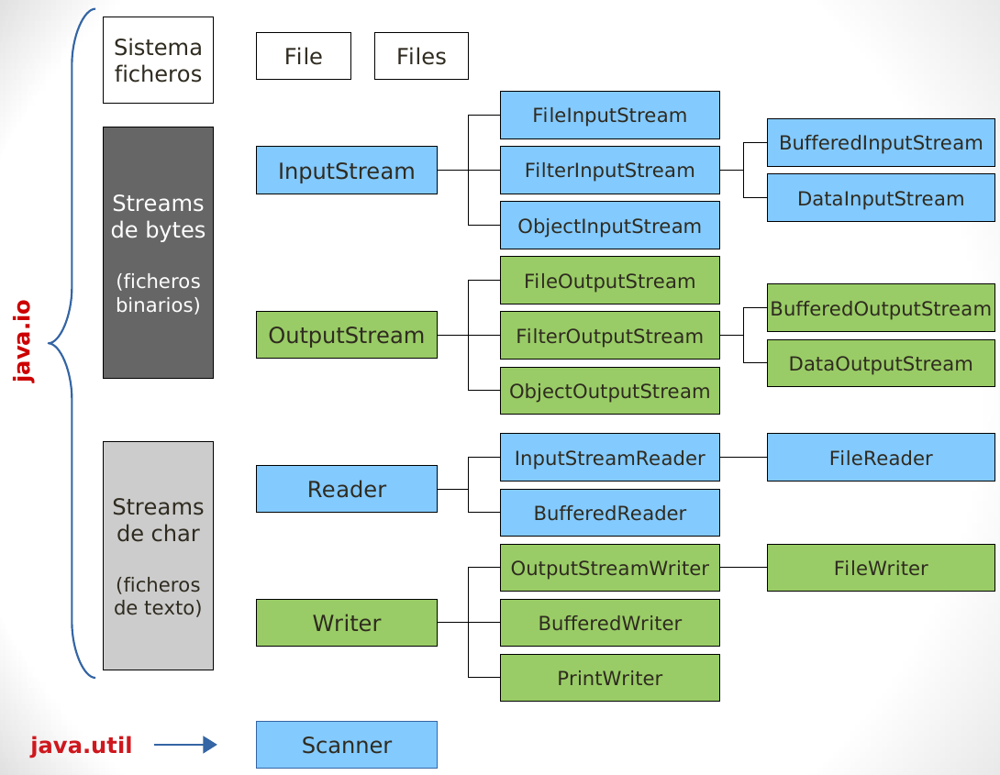

---

marp: true
size: 16:9
paginate: true
footer: '(c) 2021 Gorka Prieto'
header: 'Tema 9: Ficheros'
style: |
    section {font-size: 18pt}

---

Programación en Entornos Distribuidos{.h1}

Tema 9: Ficheros{.h2}

<br/>

{.line}

<br/>

2º Ingeniería en Tecnología de Telecomunicación (UPV/EHU){.s3}

Curso 2021/2022{.s3}

---

Licencia de uso{.h1}

©2019-2022, Gorka Prieto Agujeta <<gorka.prieto@ehu.eus>>

Este documento está derivado de documentos anteriores desarrollados por Jose Daniel Gutiérrez Porset, Gaizka Abaroa Erkoreka y Javier del Ser Lorente.

Se otorga permiso para copiar, distribuir y/o modificar este documento bajo los términos de la Licencia de Documentación Libre de GNU en su versión 1.2 o cualquier otra versión posterior publicada por la Free Software Foundation, siendo todo él invariante. Una copia de la licencia está disponible en la web de la Free Software Foundation, dentro de la sección titulada GNU Free Documentation License.

[yes]: figs/yes.png
[no]: figs/no.png

---

Índice{.h1}

@[toc]

---

# Introducción

- En Java los ficheros se manejan mediante flujos de entrada/salida (**I/O streams**): 
    - Flujo de entrada (**input stream**) para leer datos desde una **fuente** genérica
     
    - Flujo de salida (**output stream**) para escribir datos en un **destino** genérico
- Modelo abstracto, la fuente y el destino pueden ser cualquier cosa:
    - Ficheros del disco duro, dispositivos, otros programas, memoria, una conexión de red, etc.
- Los flujos pueden llevar diferentes tipos de **datos**:
    - Bytes, tipos de datos primitivos, caracteres e incluso objetos.
- Disponemos de tres flujos especiales creados automáticamente:
    - `System.in`, `System.out` y `System.err`

:::note
https://docs.oracle.com/javase/tutorial/essential/io/streams.html
:::

---

# Clases

- ¡Una veintena de clases diferentes!
- Podemos organizarlas en 3 grupos:
    - Clases para procesar flujos de bytes (**binario**):
        - Llevan las palabras `InputStream` o `OutputStream` en el nombre
    - Clases para procesar flujos de caracteres (**texto**):
        - Llevan la palabra `Reader` o `Writer` en el nombre
    - Clases para operar sobre el **sistema** de ficheros
- Clases específicas de **ficheros**:
    - Llevan la palabra `File` en el nombre
- Clases para mejorar el rendimiento mediante un **buffer**:
    - Llevan la palabra `Buffered` en el nombre

---



---

## Flujos binarios

<div class="cols"><div>

### InputStream

- `FileInputStream`: lectura de ficheros byte a byte
- `ObjectInputStream`: lectura de ficheros con objetos (ver serialización)
- `FilterInputStream`: transforma un flujo de datos de entrada
    - `BufferedInputStream`: lectura con buffer, más eficiente
    - `DataInputStream`: lectura de tipos de datos primitivos (`int`, `double`, etc.)

</div><div>

### OutputStream

- `FileOutputStream`: escritura de ficheros byte a byte
- `ObjectOutputStream`: escritura de ficheros con objetos (ver serialización)
- `FilterOutputStream`: transforma un flujo de datos de salida
    - `BufferedOutputStream`: escritura con buffer, más eficiente
    - `DataOutputStream`: escritura de tipos de datos primitivos (`int`, `double`, etc.)

</div></div>

---

### Serialización

- Definición:
    - Serializar → transformar un objeto en un conjunto de bytes para almacenarlo o transmitirlo
    - Deserializar → recuperar el objeto a partir del conjunto de bytes
- Clases Java:
    - Interfaz `Serializable` → vacía, sólo para marcar una clase como serializable
    - `ObjectOutputStream` → permite serializar un objeto a un flujo
    - `ObjectInputStream` → permite deserializar desde un flujo
- ¿Qué se serializa?:
    - Nombre completo de la clase
    - Firma de la clase
    - Valores de atributos no estáticos

---

## Flujos de caracteres

<div class="cols"><div>

- Soportan UNICODE
- Entrada (`Reader`) y salida (`Writer`)

### Reader

- `InputStreamReader`: convierte un flujo de entrada de bytes en un flujo de chars
    - `FileReader`: lectura desde fichero
- `BufferedReader`: incorpora un buffer de entrada de chars, método `readLine()`


</div><div>

### Writer

- `OutputStreamWriter`: convierte un flujo de salida de chars en en flujo de bytes
    - `FileWriter`: escritura a fichero
- `BufferedWriter`: incorpora un buffer de salida de chars (eficiencia)
- `PrintWriter`: métodos `print()`, `println()`, `printf()`, etc.


</div></div>

---

## Sistema de ficheros

### Clase File

- Permite referenciar un **fichero o un directorio**, <u>sin crear flujos</u>
    - No tiene por qué existir, y si no existe no lo crea:
    - Útil para comprobar si existe y ver propiedades
- Constructores:
    ```java
    public File(String nombreCompleto)
    public File(String ruta, String nombre)
    public File(File ruta, String nombre)
    ```
    Por ejemplo:
    ```java
    File ficheroEntrada = new File("/home/gorka/entrada.dat");
    File directorio = new File("/home/gorka");
    File ficheroSalida = new File(directorio, "salida.txt");
    ```
- Métodos no estáticos (operan sobre el *pathname* actual):
    `exists()`, `canRead()`, `canWrite()`, `length()`, `getName()`, `getParent()`, `getPath()`, `listFiles()`, `mkdir()`, `renameTo()`, `delete()`, `createNewFile()`, etc.

---

### Java NIO (New I/O)

- API alternativa de Java para trabajar con entrada/salida (paquete `java.nio.file`)
- En lugar de *streams* usa *channels* y trabaja con *buffers* en lugar de dato a dato
- Utiliza la clase `Path` para indicar rutas de ficheros o directorios:
    ```java
    Path fichero = Paths.get("/home/gorka/fichero.txt");
    ```
- Proporciona la clase `Files` para gestión de ficheros:
    - Únicamente métodos estáticos para operar sobre ficheros o directorios
    - Métodos estáticos (se les pasa el `Path` como parámetro):
        `copy()`, `move()`, `delete()`, `createFile()`, `createDirectory()`, `createTempFile()`, `createTempDirectory()`, `readAllBytes()`, `readAllLines()`, `exists()`, `isReadable()`, `isWritable()`, `size()`, etc.

<!-- Java NIO mejor rendimiento pero más compleja -->

---

<style scoped>
    pre {
        font-size: 12pt;
    }
</style>

# Ejemplos

## Sistema de ficheros

```java
package eus.ehu.ped.ficheros;

import java.io.File;

public class EjemploFS {
    public static void main(String[] args) {
        File homeDir = new File("/tmp");
        for( File entry : homeDir.listFiles() ) {
            if( entry.getName().charAt(0) == '.' ) // hidden
                continue;
            if( entry.isFile() )
                System.out.printf("%s (%d bytes)\n", entry.getName(), entry.length());
            else if( entry.isDirectory() )
                System.out.println(entry.getName()+"/");
        }
    }
}
```

```sh
output1551454488167 (10 bytes)
jarfscachegorka/
Temp-e347e70d-18c2-4cde-8acd-ed87a4ebb932/
glide_status (31 bytes)
Temp-3e580844-b470-4e5c-9210-f7f1da43418c/
osversion.tmp (26 bytes)
...
```

---

## Flujos binarios

### Flujos binarios con bytes

```java
public class EjemploCopiaManual {
    public static void main(String[] args) {        
        File org = new File("/tmp/osversion.tmp");
        File dst = new File("/tmp/prueba");
        
        if( !org.exists() || !org.isFile() ) {
            System.err.println("No existe el fichero de entrada");
            return;
        }
        if( dst.exists() ) {
            System.err.println("Ya existe el fichero de destino");
            return;
        }
        
        copy(org, dst);
    }
    
    private static void copy(File org, File dst) {
        try(
            InputStream is = new BufferedInputStream(new FileInputStream(org));
            OutputStream os = new BufferedOutputStream(new FileOutputStream(dst));
        ) {
            copy(is, os);
        } catch( Exception e ) {
            System.err.println("Error al copiar ficheros: " + e.getMessage());
        }
    }
    
    private static void copy(InputStream is, OutputStream os) throws IOException {
        int data;
        while( (data = is.read()) != -1 )
            os.write(data);
    }
}
```

---

### Flujos binarios con array de bytes

```java
public class EjemploCopiaBuffer {
    
    // main() como en el ejemplo anterior
    
    private static void copy(File org, File dst) {
        try(
            InputStream is = new FileInputStream(org);
            OutputStream os = new FileOutputStream(dst);
        ) {
            copy(is, os);
        } catch( Exception e ) {
            System.err.println("Error al copiar ficheros: " + e.getMessage());
        }
    }
    
    private static void copy(InputStream is, OutputStream os) throws IOException {
        byte[] buffer = new byte[SIZE];
        int len;
        
        while( (len = is.read(buffer)) > 0 )
            os.write(buffer, 0, len);
    }
    
    private static final int SIZE = 100;
}
```

---

### Flujos binarios con tipos primitivos

```java
public class EjemploDataStreams {
    public static void main(String[] args) {
        File original = new File("original.dat");
        File redondeo = new File("redondeo.dat");        
        double[] valores = {1.1, 1.8, 3.2, 5.7, 8.8, 10.0};
        
        try {
            creaOriginal(valores, original);
            creaRedondeo(original, redondeo);
        } catch(IOException e) {
            e.printStackTrace();
        }
    }
    
    private static void creaOriginal(double[] valores, File file) throws IOException {
        try (
            DataOutputStream dos = new DataOutputStream(new FileOutputStream(file));
        ) {
            dos.writeInt(valores.length);
            for( double valor : valores )
                dos.writeDouble(valor);
        }
    }

    private static void creaRedondeo(File original, File redondeo) throws IOException {
        try (
            DataInputStream dis = new DataInputStream(new FileInputStream(original));
            DataOutputStream dos = new DataOutputStream(new FileOutputStream(redondeo));
        ) {
            int len = dis.readInt();
            dos.writeInt(len);
            for( int i = 0; i < len; i++ ) {
                long valor = Math.round(dis.readDouble());
                dos.writeLong(valor);
            }
        }
    }
}
```

---

<style scoped>
    footer {
        display: none;
    }
</style>

### Serialización

```java
class Alumno implements Serializable {
    private String nombre;
    private double nota;
    
    // getters and setters
}

public class EjemploSerializacion {
    public static void main(String[] args) {
        Alumno a1 = new Alumno(), a2;
        a1.setNombre("John Doe");
        a1.setNota(8.5);
        
        try {
            serializa(a1, "alumno.dat");
            a2 = deserializa("alumno.dat");        
            System.out.printf("%s: %.2f\n", a2.getNombre(), a2.getNota());
        } catch( IOException | ClassNotFoundException e ) {
            e.printStackTrace();
        }
    }

    private static void serializa(Alumno a1, String fichero) throws IOException {
        try( ObjectOutputStream oos = new ObjectOutputStream(new FileOutputStream(fichero)) ) {
            oos.writeObject(a1);
        }
    }

    private static Alumno deserializa(String fichero) throws IOException, ClassNotFoundException {
        try( ObjectInputStream ois = new ObjectInputStream(new FileInputStream(fichero)) ) {
            return (Alumno)ois.readObject();
        }
    }
}
```

```sh
John Doe: 8.50
```

---

## Flujos de caracteres

### Leer y escribir líneas de texto

```java
public class EjemploTexto {
    public static void main(String[] args) {
        Alumno[] alumnos = {
            new Alumno("John Doe", 8.5),
            new Alumno("Jane Doe", 9.5)
        };
        
        try {
            guardaNotas(alumnos, "notas.txt");
            muestraNotas("notas.txt");
        } catch( IOException e ) {
            e.printStackTrace();
        }
    }

    private static void guardaNotas(Alumno[] alumnos, String fichero) throws IOException {
        try( PrintWriter pw = new PrintWriter(fichero) ) {
            for( Alumno a : alumnos ) {
                pw.print(a.getNombre());
                pw.print(':');
                pw.println(a.getNota());
            }
        }
    }

    private static void muestraNotas(String notastxt) throws IOException {
        try( BufferedReader br = new BufferedReader(new FileReader(notastxt)) ) {
            String line;
            while( (line = br.readLine()) != null )
                System.out.println(line);
        }
    }
}

// John Doe: 8.5
// Jane Doe: 9.5
```

---

### Procesamiento de fichero de texto

```java
public class EjemploParseo {
    public static void main( String[] args ) throws IOException {
        List<Alumno> alumnos = cargaAlumnos("notas.txt");
        double media = 0;
        for( Alumno a : alumnos )
            media += a.getNota();
        media /= alumnos.size();
        System.out.println("Nota media = " + media);
    }

    private static List<Alumno> cargaAlumnos(String fichero) throws IOException {
        List<Alumno> alumnos = new ArrayList<>();
        try( BufferedReader br = new BufferedReader(new FileReader(fichero)) ) {
            String line;
            String[] fields;
            while( (line=br.readLine()) != null ) {
                fields = line.split(":");
                Alumno a = new Alumno();
                a.setNombre(fields[0]);
                a.setNota(Double.parseDouble(fields[1]));
                alumnos.add(a);
            }
        }
        return alumnos;
    }
}

// Nota media = 9.0
```

---

### Procesamiento de fichero de texto con Scanner

```java
public class EjemploScanner {
    
    // main() como en el ejemplo anterior

    private static List<Alumno> cargaAlumnos(String fichero) throws IOException {
        List<Alumno> alumnos = new ArrayList<>();
        try( Scanner sc = new Scanner(new File(fichero)) ) {
            sc.useLocale(Locale.US);
            sc.useDelimiter("[:\\n]");
            while( sc.hasNext() ) {
                Alumno a = new Alumno();
                a.setNombre(sc.next());
                a.setNota(sc.nextDouble());
                alumnos.add(a);
            }
        }
        return alumnos;
    }
}

// Nota media = 9.0
```

---

### Conversión entre flujos binario ↔ texto

```java
public class EjemploCopiaMezcla {
    
    // main() como en los ejemplos de copia
    
    // copy() de File como en los ejemplos de copia
    
    private static void copy(InputStream is, OutputStream os) throws IOException {
        try (
            BufferedReader br = new BufferedReader(new InputStreamReader(is));
            PrintWriter pw = new PrintWriter(new OutputStreamWriter(os));
        ) {
            String line;
            while( (line = br.readLine()) != null )
                pw.println(line);
        }
    }
}
```

----

## Algunos errores comunes

```java
public class ErroresComunes {
    private static void errorCloseBuffered(File org, File dst) throws IOException {
        FileInputStream fis = new FileInputStream(org);
        FileOutputStream fos = new FileOutputStream(dst);
        
        InputStream bis = new BufferedInputStream(fis);
        OutputStream bos = new BufferedOutputStream(fos);

        copy(bis, bos);
        
        fis.close();
        fos.close();
        
        // ¿cuáles hay que cerrar?, ¿por qué?, ¿cómo lo arreglarías?
    }
    
    private static void errorFlushBuffered(BufferedInputStream is, BufferedOutputStream os) 
    throws IOException {
        int data;
        while( (data = is.read()) != -1 )
            os.write(data);
        
        // ¿por qué necesario flush()?, ¿sobre qué objeto?
    }
}
```